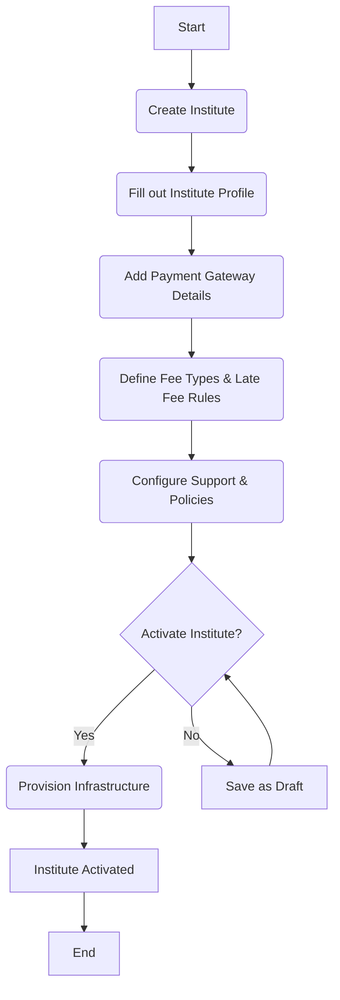

# Onboarding an Institute

## Introduction

Onboarding an Institute allows platform-level Admins to create and configure new institutes within a multi-tenant fees management ecosystem.
Each onboarded institute functions as an independent tenant, with complete isolation of its data, configurations, workflows, and integrations.

Each institute functions as a fully isolated tenant with its own dedicated:

- Administrative users & roles

- Payment gateway configurations

- Fee types 

- Student master data

- Branding assets (logo, brochure, promotional video, etc.)

- Payout details, and transaction logs

- Email Notification templates

## Why a Multi-Tenant Architecture?

The School Fees Portal is designed to onboard **N number of institutes**, each working independently.  
This architecture provides:

| Benefit | Explanation |
|--------|-------------|
| **Scalability** | Any number of institutes can be added without affecting others. |
| **Data Isolation** | Record rules ensure one institute cannot access another’s data. |
| **Customisation** | Each institute has its own fees, admins, branding, and PG setup. |
| **Operational Independence** | If one institute faces issues, others remain unaffected. |
| **Centralised Governance** | Super Admin retains global visibility and control. |

---

## Onboarding Workflow (Step-by-Step)

The onboarding flow is intentionally modular. An institute can start with basic configuration and progressively enable more features. Below is an explanation of each phase of the institute onboarding workflow.



### 1. Institute Profile

The institute profile is the foundational step where the super admin captures the core details of the institute. This includes the Institute's Name, Address, Contact Information, Hoted Page Prefix and Branding elements like the Logo and Intro video.


> **Tip:** Hosted Page Prefix acts as the unique subdomain allocated to each institute.
It must be unique, and once the institute is activated, it becomes the public-facing URL for all hosted pages.

> Example: `https://<hostedpageprefix>.test.com`

### 2. Payment Gateway Details

This phase involves linking the institute's own payment gateway (PG) credentials to the platform. This ensures that all fees collected from students are routed directly to the institute's bank account. The platform securely stores the API keys, secrets, and other credentials required for the integration.


### 3. Support & Policies Declaration

In this step, the institute defines important communication details and policy documents that will be visible to students and parents inside the student portal. These details help establish trust, compliance, and transparency.

#### The configuration includes:

**Email Domain:**
An optional domain restriction used to validate institute admin user accounts.

If a domain is provided (e.g., test.com), only users with matching email domains can be added as institute admins:

- admin@test.com
- admin1@test.com

> **Tip**
> If no domain is configured, any email address will be accepted.

**Support Contact:**
Official support email address and mobile number for handling inquiries, issues, and general communication.

**Privacy Policy:**
A declaration explaining how the institute collects, uses, stores, and protects student and parent data.

**Terms and Conditions (T&C):**
Guidelines and rules for using the institute’s portal, payment services, and related features.

**FAQs:**
Commonly asked questions regarding fee payments, receipts, refunds, deadlines, and general portal usage.


### 4. Fee Types & Late Fee Rules

This is a critical step where the institute defines its fee structure. This includes:

- **Fee Types:** Creating different categories of fees, such as "Tuition Fee," "Hostel Fee," "Library Fee," etc.
- **Late Fee Rules:** Configuring penalties for late payments, which can be a fixed amount or a percentage of the outstanding fee.
- **Part Payment:** Allows the admin to enable or disable partial payment support for fee collection.


## Activate/Deactivate Institute

The Super Admin has the ability to activate or deactivate any institute within the system. Activation provisions all required infra-level configurations, while deactivation disables the institute’s public access routing.

### Step 1: Add “Activate/Deactivate” Button in Cogwheel Settings


This action requires updating the institute-form-view configuration.

Add a new action entry under the Layout and formButtons to render the “Activate” or “Deactivate” button based on the institute status.

> **Info**
> Developer Note:
> Add below code in institute-form-view where custom actions are registered.

```json
{
      "name": "institute-form-view",
      "displayName": "Institute",
      "type": "form",
      "context": "{}",
      "moduleUserKey": "fees-portal",
      "modelUserKey": "institute",
      "layout": {
        "type": "form",
        "attrs": {
          "name": "form-1",
          "label": "Institute",
          "className": "grid",
          "formButtons": [
            {
              "attrs": {
                "icon": "pi pi-caret-right",
                "name": "InstituteActivateById",
                "className": "p-button-text",
                "label": "Activate Institute",
                "action": "InstituteActivateById",
                "customComponentIsSystem": true,
                "actionInContextMenu": true,
                "openInPopup": true,
                "visible": false
              }
            },
            {
              "attrs": {
                "icon": "pi pi-circle-off",
                "name": "InstituteDeactivateById",
                "className": "p-button-text",
                "label": "Deactivate Institute",
                "action": "InstituteDeactivateById",
                "customComponentIsSystem": true,
                "actionInContextMenu": true,
                "openInPopup": true,
                "visible": false
              }
            }
          ]
        },
      },
}
```

### Step 2: Create the Activation Popup Component

A custom popup modal must be created to handle the user confirmation workflow.
The modal will be invoked when the action button is clicked from the cogwheel menu.


#### Source code for Activation Popup Component

```jsx

import React, { useRef } from 'react';
import { Toast } from 'primereact/toast';
import { Button } from 'primereact/button';
import { Dialog } from 'primereact/dialog';
import { useDispatch } from 'react-redux';
import { closePopup } from '@solidstarters/solid-core-ui/dist/redux/features/popupSlice';
import { createSolidEntityApi } from '@solidstarters/solid-core-ui';
import axios from 'axios';
import { getSession } from 'next-auth/react';

const API_URL = process.env.NEXT_PUBLIC_BACKEND_API_URL;

const InstituteActivateById = (action: any) => {
  const dispatch = useDispatch()
  const toast = useRef<Toast>(null);
  const [visible, setVisible] = React.useState(true);

  const entityApi = createSolidEntityApi("institute");
  const {
    usePatchUpdateSolidEntityMutation: usePatchUpdateAgreementyMutation,
  } = entityApi;

  const [
    patchAgreement,
  ] = usePatchUpdateAgreementyMutation();

  const showToast = (severity: 'success' | 'info' | 'warn' | 'error', summary: string, detail: string) => {
    toast.current?.show({ severity, summary, detail, life: 3000 });
  };

  const activateInstitute = async () => {

    try {
      const session: any = await getSession();
      const token = session?.user?.accessToken || '';

      const response = await axios.post(
        `${API_URL}/api/institute/activate/${action?.params?.id}`,
        {},
        {
          headers: {
            Authorization: `Bearer ${token}`,
          },
        }
      );

      if (response.status === 201 || response.status === 200) {
        setTimeout(() => dispatch(closePopup()), 1000);
        //update status in table
        const result = await patchAgreement({
          id: action?.params?.id,
          data: {
            status: 'Active'
          }
        }).unwrap();

        if (result.statusCode === 200) {
          dispatch(closePopup());
        }
        showToast('success', 'Success', 'Institute activated successfully.');
      }
    } catch (error) {
      showToast('error', 'Error', 'Failed to activate institute.');
    }

  };

  const footerContent = (
    <div>
      
      <Button label="Cancel" icon="pi pi-times" onClick={() => dispatch(closePopup())} />
    </div>
  );

  return (
    <>
      
      <Dialog
        header="Activate institute ?"
        visible={visible}
        style={{ width: '30vw' }}
        modal
        onHide={() => dispatch(closePopup())}
        dismissableMask={false}
        footer={footerContent}
      >
        <div>
          <p>Clicking Ok below will activate and host this institute, are you sure you want to continue?</p>
        </div>
      </Dialog>
    </>
  );
};

export default InstituteActivateById;

```

### Step 3: Activation Workflow (Backend Integration)

`Write new Controller in institute.controller.ts`

```typescript
@ApiBearerAuth("jwt")
@Post('activate/:id')
async activateFeePortal(@Param('id') id: number) {
  return this.service.activateInstitutePortal(id);
}
```

`Create activateInstitutePortal in institute.service.ts`

```ts
async activateInstitutePortal(id: number): Promise<{ message: string }> {
    const institute = await this.findOne(id, {});
    const baseDoamin = process.env.EDU_BASE_DOMAIN || 'edu.antpay.live';

    const domainName = `${institute.hostedPagePrefix}-${baseDoamin}`;
    await this.nginxVirtualHostProvider.makeVirtualHost(domainName);

    // for local; in prod point to public IPv4 of your ingress
    const portalCnameDomain = process.env.PORTAL_CNAME_DOMAIN;
    if (!portalCnameDomain) {
      throw new NotAcceptableException("Portal CNAME not configured", `When activating a new institute portal, you need to specify a .env variable called PORTAL_CNAME_DOMAIN.`);
    }
    await this.dns.createCnameRecord(domainName, portalCnameDomain, 300);

    institute.status = 'Active';
    await this.repo.save(institute);

    // Make an audit entry also from here...
    const postMessageOnActivate: PostChatterMessageDto = {
      coModelEntityId: institute.id,
      coModelName: 'institute',
      messageBody: `
### Institute Activated
Institute is now live on domain: <a href="${domainName}" target="_blank" rel="noopener noreferrer">${domainName}</a>
      `
    }
    this.chatterMessageService.postMessage(postMessageOnActivate)

    return {
      message: `activated Institute ${id}`
    };
  }
```

### Step 4: Nginx and Route 53 (AWS) Registration (If Configured)

Upon confirming activation, the system performs infra-level provisioning tasks:

### a. Local Nginx Configuration

A local Nginx configuration file is generated using the institute’s hostedPagePrefix.
This ensures that the institute’s landing page and portal are routed correctly.

create file `solid-api/src/module-name/interfaces/nginx-virtual-host-provider.ts`

```typescript
export interface INginxVirtualHostProvider {
    /** Creates/updates a vhost for `domain` and restarts nginx */
    makeVirtualHost(domain: string): Promise<void>;

    /** Removes the vhost for `domain` (sites-available + sites-enabled) and restarts nginx */
    removeVirtualHost(domain: string): Promise<void>;
}

// src/nginx/tokens.ts
export const NGINX_VHOST_PROVIDER = Symbol('NGINX_VHOST_PROVIDER');
```

create `ubuntu-nginx-virtual-host-provider.ts` in  `solid-api/src/module-name/services/`

```typescript
import { Injectable, Logger } from '@nestjs/common';
import { exec as _exec } from 'node:child_process';
import { promisify } from 'node:util';
import { promises as fs } from 'node:fs';
import * as path from 'node:path';
import { INginxVirtualHostProvider } from '../interfaces/nginx-virtual-host-provider';

const exec = promisify(_exec);

@Injectable()
export class UbuntuNginxVirtualHostProvider implements INginxVirtualHostProvider {
    private readonly logger = new Logger(UbuntuNginxVirtualHostProvider.name);

    private sitesAvailableDir = '/etc/nginx/sites-available';
    private sitesEnabledDir = '/etc/nginx/sites-enabled';
    private listenPort = 80;

    async makeVirtualHost(domain: string): Promise<void> {
        this.validateDomain(domain);

        const confPath = path.join(this.sitesAvailableDir, `${domain}.conf`);
        const symlinkPath = path.join(this.sitesEnabledDir, `${domain}.conf`);
        const content = this.renderServerBlock(domain);

        // 1) Write config atomically
        const tmpPath = `${confPath}.tmp`;
        await fs.writeFile(tmpPath, content, { mode: 0o644 });
        await fs.rename(tmpPath, confPath);

        // 2) Ensure symlink exists (idempotent)
        await this.ensureSymlink(confPath, symlinkPath);

        // 3) Test & reload/restart nginx
        await this.reloadNginx();
        this.logger.log(`Virtual host created for ${domain}`);
    }

    async removeVirtualHost(domain: string): Promise<void> {
        this.validateDomain(domain);

        const confPath = path.join(this.sitesAvailableDir, `${domain}.conf`);
        const symlinkPath = path.join(this.sitesEnabledDir, `${domain}.conf`);

        // Remove symlink if present
        await this.safeUnlink(symlinkPath);

        // Remove config if present
        await this.safeUnlink(confPath);

        // Test & reload/restart nginx
        await this.reloadNginx();
        this.logger.log(`Virtual host removed for ${domain}`);
    }

    // ---- helpers ----

    private renderServerBlock(domain: string): string {
        const upstream = process.env.EDU_FRONTEND_UPSTREAM || 'http://127.0.0.1:3002';

        return `server {
    server_name ${domain};

    location / {
        proxy_pass ${upstream};
        proxy_http_version 1.1;
        proxy_set_header Upgrade $http_upgrade;
        proxy_set_header Connection 'upgrade';
        proxy_set_header Host $host;
        proxy_cache_bypass $http_upgrade;
    }

    listen ${this.listenPort};
}
`;
    }

    private async ensureSymlink(target: string, linkPath: string): Promise<void> {
        try {
            const stat = await fs.lstat(linkPath);
            if (stat.isSymbolicLink()) {
                const existingTarget = await fs.readlink(linkPath);
                if (existingTarget === target) return; // already correct
                await fs.unlink(linkPath);
            } else {
                // If a regular file exists, remove to replace with symlink
                await fs.unlink(linkPath);
            }
        } catch {
            // lstat failed → no link yet
        }
        await fs.symlink(target, linkPath);
    }

    private async safeUnlink(p: string): Promise<void> {
        try {
            await fs.unlink(p);
        } catch (e: any) {
            if (e?.code !== 'ENOENT') throw e;
        }
    }

    private validateDomain(domain: string) {
        // Simple, conservative validator (ASCII hostnames). Adjust as needed.
        const re = /^(?=.{1,253}$)(?!-)([a-zA-Z0-9-]{1,63}(?<!-)\.)+[a-zA-Z]{2,63}$/;
        if (!re.test(domain)) {
            throw new Error(`Invalid domain: "${domain}"`);
        }
    }

    private async reloadNginx(): Promise<void> {
        // Assumes the NestJS process has privileges to run these commands.
        // In production, run Nest as a user with sudoers rules for these commands, or
        // move restart into a supervised orchestration step.
        await exec('nginx -t');
        // Prefer reload to avoid dropping connections
        await exec('systemctl reload nginx');
    }
}
```

b. If the deployment is configured with AWS Route 53:

- A DNS record entry will be created for the institute’s domain or subdomain
- The new entry will point to the gateway (ALB, NLB, or public IP depending on setup)
- Propagation status can be logged for audit

This enables the institute to be reachable publicly via its assigned hosted prefix.

create `website-dns-manager.ts` in `solid-api/src/module-name/services/`

```typescript
export interface IWebsiteDnsManager {
    /** Create or update an A record for `domain` pointing to IPv4 `ip` with optional TTL. */
    createARecord(domain: string, ip: string, ttl?: number): Promise<void>;

    /** Remove the A record for `domain`. */
    removeARecord(domain: string): Promise<void>;
    
    createCnameRecord(domain: string, target: string, ttl: number): Promise<void>;

    removeCnameRecord(domain: string, target: string): Promise<void>;
}

// src/dns/tokens.ts
export const WEBSITE_DNS_MANAGER = Symbol('WEBSITE_DNS_MANAGER');
```

---

create route53-website-dns.manager.ts

```typescript
import { Injectable, Logger } from '@nestjs/common';
import { Route53Client, ChangeResourceRecordSetsCommand } from '@aws-sdk/client-route-53';
import { IWebsiteDnsManager } from '../interfaces/website-dns-manager';

@Injectable()
export class Route53WebsiteDnsManager implements IWebsiteDnsManager {
    private readonly logger = new Logger(Route53WebsiteDnsManager.name);
    private readonly client: Route53Client;

    constructor(
        // injected via factory
        private readonly hostedZoneId: string,
    ) {
        // region from env/AWS SDK defaults
        this.client = new Route53Client({
            region: process.env.AWS_REGION,
            credentials: {
                accessKeyId: process.env.AWS_ACCESS_KEY_ID,
                secretAccessKey: process.env.AWS_SECRET_ACCESS_KEY,
            },
        });
    }

    // -------------------------------
    // A Record
    // -------------------------------
    async createARecord(domain: string, ip: string, ttl = 300): Promise<void> {
        await this.client.send(
            new ChangeResourceRecordSetsCommand({
                HostedZoneId: this.hostedZoneId,
                ChangeBatch: {
                    Changes: [
                        {
                            Action: 'UPSERT',
                            ResourceRecordSet: {
                                Name: domain.endsWith('.') ? domain : `${domain}.`,
                                Type: 'A',
                                TTL: ttl,
                                ResourceRecords: [{ Value: ip }],
                            },
                        },
                    ],
                    Comment: 'Managed by SolidX DNS manager',
                },
            }),
        );
        this.logger.log(`A record UPSERT ${domain} -> ${ip}`);
    }

    async removeARecord(domain: string): Promise<void> {
        // Route53 needs the current value to DELETE. A pragmatic approach is to set TTL small
        // and replace with a harmless value then delete, but better is to know current RR set.
        // Minimal implementation: attempt DELETE for common case with single record.
        await this.client.send(
            new ChangeResourceRecordSetsCommand({
                HostedZoneId: this.hostedZoneId,
                ChangeBatch: {
                    Changes: [
                        {
                            Action: 'DELETE',
                            ResourceRecordSet: {
                                Name: domain.endsWith('.') ? domain : `${domain}.`,
                                Type: 'A',
                                // If multiple IPs exist, this delete will fail. Extend later to ListResourceRecordSets first.
                                ResourceRecords: [{ Value: '0.0.0.0' }],
                                TTL: 300,
                            },
                        },
                    ],
                },
            }),
        ).catch(() => {
            // Fallback: do an UPSERT to 0.0.0.0, then delete that exact value.
            return this.client.send(new ChangeResourceRecordSetsCommand({
                HostedZoneId: this.hostedZoneId,
                ChangeBatch: {
                    Changes: [{
                        Action: 'UPSERT',
                        ResourceRecordSet: {
                            Name: domain.endsWith('.') ? domain : `${domain}.`,
                            Type: 'A',
                            TTL: 60,
                            ResourceRecords: [{ Value: '0.0.0.0' }],
                        },
                    }],
                },
            })).then(() =>
                this.client.send(new ChangeResourceRecordSetsCommand({
                    HostedZoneId: this.hostedZoneId,
                    ChangeBatch: {
                        Changes: [{
                            Action: 'DELETE',
                            ResourceRecordSet: {
                                Name: domain.endsWith('.') ? domain : `${domain}.`,
                                Type: 'A',
                                TTL: 60,
                                ResourceRecords: [{ Value: '0.0.0.0' }],
                            },
                        }],
                    },
                })),
            );
        });
        this.logger.log(`A record DELETE ${domain}`);
    }

    // -------------------------------
    // CNAME Record
    // -------------------------------
    async createCnameRecord(domain: string, target: string, ttl = 300): Promise<void> {
        await this.client.send(
            new ChangeResourceRecordSetsCommand({
                HostedZoneId: this.hostedZoneId,
                ChangeBatch: {
                    Changes: [
                        {
                            Action: 'UPSERT',
                            ResourceRecordSet: {
                                Name: domain.endsWith('.') ? domain : `${domain}.`,
                                Type: 'CNAME',
                                TTL: ttl,
                                ResourceRecords: [{ Value: target.endsWith('.') ? target : `${target}.` }],
                            },
                        },
                    ],
                    Comment: 'Managed by SolidX DNS manager (CNAME)',
                },
            }),
        );
        this.logger.log(`CNAME record UPSERT ${domain} -> ${target}`);
    }

    async removeCnameRecord(domain: string, target: string): Promise<void> {
        try {
            await this.client.send(
                new ChangeResourceRecordSetsCommand({
                    HostedZoneId: this.hostedZoneId,
                    ChangeBatch: {
                        Changes: [
                            {
                                Action: 'DELETE',
                                ResourceRecordSet: {
                                    Name: domain.endsWith('.') ? domain : `${domain}.`,
                                    Type: 'CNAME',
                                    TTL: 300,
                                    ResourceRecords: [{ Value: target.endsWith('.') ? target : `${target}.` }],
                                },
                            },
                        ],
                    },
                }),
            );
        } catch (err) {
            this.logger.warn(`CNAME DELETE failed for ${domain}, retrying via UPSERT cleanup...`);
            // fallback: upsert then delete
            await this.client.send(new ChangeResourceRecordSetsCommand({
                HostedZoneId: this.hostedZoneId,
                ChangeBatch: {
                    Changes: [{
                        Action: 'UPSERT',
                        ResourceRecordSet: {
                            Name: domain.endsWith('.') ? domain : `${domain}.`,
                            Type: 'CNAME',
                            TTL: 60,
                            ResourceRecords: [{ Value: target.endsWith('.') ? target : `${target}.` }],
                        },
                    }],
                },
            }));

            await this.client.send(new ChangeResourceRecordSetsCommand({
                HostedZoneId: this.hostedZoneId,
                ChangeBatch: {
                    Changes: [{
                        Action: 'DELETE',
                        ResourceRecordSet: {
                            Name: domain.endsWith('.') ? domain : `${domain}.`,
                            Type: 'CNAME',
                            TTL: 60,
                            ResourceRecords: [{ Value: target.endsWith('.') ? target : `${target}.` }],
                        },
                    }],
                },
            }));
        }
        this.logger.log(`CNAME record DELETE ${domain}`);
    }
}
```

### Step 5: Create the Deactivation Popup Component 

```jsx

import React, { useRef } from 'react';
import { Toast } from 'primereact/toast';
import { Button } from 'primereact/button';
import { Dialog } from 'primereact/dialog';
import { useDispatch } from 'react-redux';
import { closePopup } from '@solidstarters/solid-core-ui/dist/redux/features/popupSlice';
import { createSolidEntityApi } from '@solidstarters/solid-core-ui';
import axios from 'axios';
import { getSession } from 'next-auth/react';

const API_URL = process.env.NEXT_PUBLIC_BACKEND_API_URL;

const InstituteDeactivateById = (action: any) => {
  const dispatch = useDispatch()
  const toast = useRef<Toast>(null);
  const [visible, setVisible] = React.useState(true);

  const entityApi = createSolidEntityApi("institute");
  const {
    usePatchUpdateSolidEntityMutation: usePatchUpdateAgreementyMutation,
  } = entityApi;

  const [
    patchAgreement,
  ] = usePatchUpdateAgreementyMutation();

  const showToast = (severity: 'success' | 'info' | 'warn' | 'error', summary: string, detail: string) => {
    toast.current?.show({ severity, summary, detail, life: 3000 });
  };

  const deactivateInstitute = async () => {
    try {
      const session: any = await getSession();
      const token = session?.user?.accessToken || '';

      const response = await axios.post(
        `${API_URL}/api/institute/deactivate/${action?.params?.id}`,
        {},
        {
          headers: {
            Authorization: `Bearer ${token}`,
          },
        }
      );

      if (response.status === 201 || response.status === 200) {
        setTimeout(() => dispatch(closePopup()), 1000);
        //update status in table
        const result = await patchAgreement({
          id: action?.params?.id,
          data: {
            status: 'InActive'
          }
        }).unwrap();

        if (result.statusCode === 200) {
          dispatch(closePopup());
        }
        showToast('success', 'Success', 'institute Deactivated successfully.');
      }
    } catch (error) {
      showToast('error', 'Error', 'Failed to activate institute.');
    }

  };

  const footerContent = (
    <div>
      
      <Button label="Cancel" icon="pi pi-times" onClick={() => dispatch(closePopup())} />
    </div>
  );

  return (
    <>
      
      <Dialog
        header="Deactivate institute?"
        visible={visible}
        style={{ width: '30vw' }}
        modal
        onHide={() => dispatch(closePopup())}
        dismissableMask={false}
        footer={footerContent}
      >
        <div>
          <p>Clicking Ok below will Deactivate this institute, are you sure you want to continue?</p>
        </div>
      </Dialog>
    </>
  );
};

export default InstituteDeactivateById;

```

### Register Custom Component in -> `solid-ui/app/solid-extension.ts`

```jsx
import { registerExtensionComponent, registerExtensionFunction } from "@solidstarters/solid-core-ui";
import InstituteActivateById from "./admin/extensions/headerButtons/activate-portal";
import InstituteDeactivateById from "./admin/extensions/headerButtons/deActivate-portal";

registerExtensionComponent('InstituteActivateById',InstituteActivateById);
registerExtensionComponent('InstituteDeactivateById',InstituteDeactivateById);
```

> **Tip**
> like above you can create custom components and render in the current porject based on bussiness requirment

## Conclusion

This guide has walked you through the process of onboarding a new institute, from initial setup to activation. By following these steps, you can efficiently configure and launch new tenants in the multi-tenant school fees management ecosystem. The modular design of the platform allows for flexibility and scalability, ensuring that each institute can be tailored to its specific needs.
