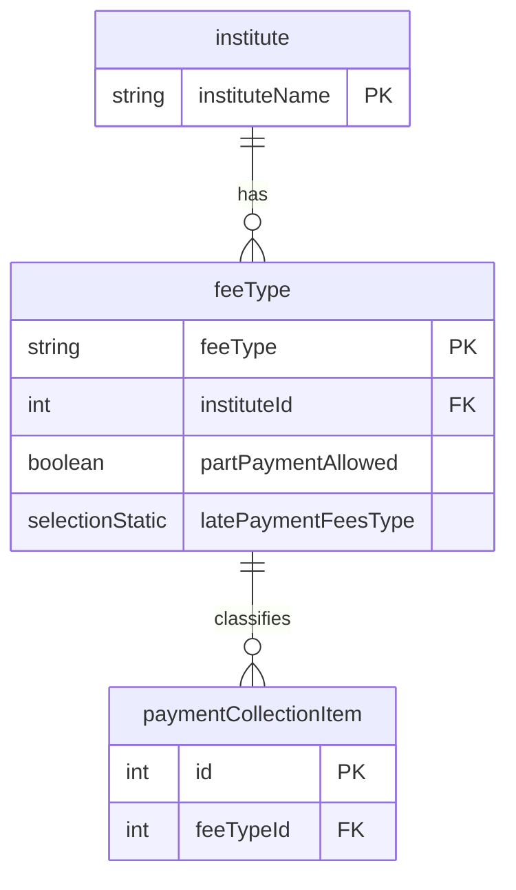

# Fee Type Model

**Business Purpose:** Defines the different types of fees an institute can charge (e.g., Tuition, Bus Fee, Library Fee). This allows for categorization and management of fees.

**Fields:**

| Field Name | Type | Description |
|---|---|---|
| `feeType` | `shortText` | The name of the fee type. |
| `institute` | `relation` | A many-to-one relationship to the `institute` model. |
| `partPaymentAllowed` | `boolean` | Whether partial payments are allowed for this fee type. |
| `latePaymentFeesType` | `selectionStatic` | The type of late fee to apply (None, Percent, Absolute). |
| `latePaymentFees` | `decimal` | The amount or percentage for the late fee. |
| `feeTypeUserKey` | `computed` | A unique key for the fee type, computed from the fee type and institute name. |

**ER Diagram:**



**fee-type**


**Metadata JSON:**


<details>
<summary>&emsp; View Metadata JSON</summary>

```json
{
  "singularName": "feeType",
  "pluralName": "feeTypes",
  "displayName": "Fee Type",
  "description": "Model used to capture different fee types that a school, institute might use.",
  "dataSource": "default",
  "dataSourceType": "postgres",
  "tableName": "fees_portal_fee_type",
  "userKeyFieldUserKey": "feeTypeUserKey",
  "isChild": false,
  "enableAuditTracking": true,
  "enableSoftDelete": false,
  "draftPublishWorkflow": false,
  "internationalisation": false,
  "fields": [
    {
      "name": "feeType",
      "displayName": "Fee Type",
      "description": "The actual fee type. Eg. Tuition Fees, Bus Fees",
      "type": "shortText",
      "ormType": "varchar",
      "isSystem": false,
      "defaultValue": null,
      "min": null,
      "max": null,
      "required": true,
      "unique": false,
      "index": false,
      "private": false,
      "encrypt": false,
      "encryptionType": null,
      "decryptWhen": null,
      "columnName": null,
      "isUserKey": true,
      "enableAuditTracking": true
    },
    {
      "name": "institute",
      "displayName": "Institute",
      "description": null,
      "type": "relation",
      "ormType": "integer",
      "isSystem": false,
      "relationType": "many-to-one",
      "relationCoModelFieldName": "feeTypes",
      "relationCreateInverse": true,
      "relationCoModelSingularName": "institute",
      "relationCoModelColumnName": null,
      "relationModelModuleName": "fees-portal",
      "relationCascade": "cascade",
      "required": true,
      "unique": false,
      "index": false,
      "private": false,
      "encrypt": false,
      "encryptionType": null,
      "decryptWhen": null,
      "columnName": null,
      "relationJoinTableName": null,
      "isRelationManyToManyOwner": null,
      "relationFieldFixedFilter": "",
      "enableAuditTracking": true
    },
    {
      "name": "partPaymentAllowed",
      "displayName": "Part Payment Allowed",
      "description": null,
      "type": "boolean",
      "ormType": "boolean",
      "isSystem": false,
      "defaultValue": null,
      "required": true,
      "index": false,
      "private": false,
      "encrypt": false,
      "encryptionType": null,
      "decryptWhen": null,
      "columnName": null,
      "enableAuditTracking": true
    },
    {
      "name": "latePaymentFeesType",
      "displayName": "Late Payment Fees Type",
      "description": null,
      "type": "selectionStatic",
      "ormType": "varchar",
      "isSystem": false,
      "defaultValue": "None",
      "selectionStaticValues": [
        "None:None",
        "Percent:Percent",
        "Absolute:Absolute"
      ],
      "selectionValueType": "string",
      "required": false,
      "unique": false,
      "index": false,
      "private": false,
      "encrypt": false,
      "encryptionType": null,
      "decryptWhen": null,
      "columnName": null,
      "enableAuditTracking": true,
      "isMultiSelect": false
    },
    {
      "name": "latePaymentFees",
      "displayName": "Late Payment Fees",
      "description": null,
      "type": "decimal",
      "ormType": "decimal",
      "isSystem": false,
      "defaultValue": "0",
      "min": null,
      "max": null,
      "required": false,
      "unique": false,
      "index": false,
      "private": false,
      "encrypt": false,
      "encryptionType": null,
      "decryptWhen": null,
      "columnName": null,
      "enableAuditTracking": true
    },
    {
      "name": "feeTypeUserKey",
      "displayName": "Fee Type User Key",
      "description": "Concatenation of fee type and institute name",
      "type": "computed",
      "ormType": "varchar",
      "isSystem": false,
      "computedFieldValueType": "string",
      "computedFieldTriggerConfig": [
        {
          "modelName": "feeType",
          "moduleName": "fees-portal",
          "operations": [
            "before-insert"
          ]
        }
      ],
      "computedFieldValueProvider": "ConcatEntityComputedFieldProvider",
      "computedFieldValueProviderCtxt": "{\n  \"fields\": [\n    \"feeType\",\n    \"institute.instituteName\" 
  ],
  \"separator\": \"-\",
  \"slugify\": true
}",
      "required": true,
      "unique": true,
      "index": false,
      "private": false,
      "encrypt": false,
      "encryptionType": null,
      "decryptWhen": null,
      "columnName": null,
      "isUserKey": true
    }
  ]
}
```

</details>

**Apply Changes:** Apply model changes as guided in Data Modeling page.