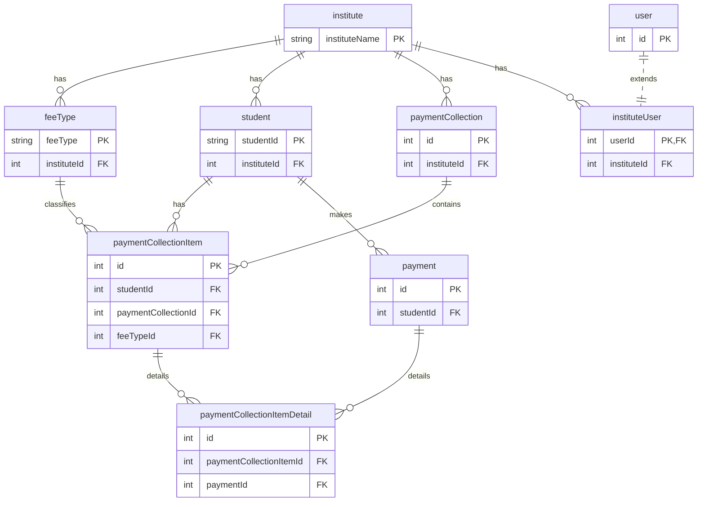

# 3. Data Modeling

In this step, we will design the data model for our school fees portal by accessing the admin interface of our newly bootstrapped SolidX project.

## Login

First, log in to the SolidX admin panel by visiting the URL for the frontend app (e.g., `http://localhost:8081`). Use the default username and password that were generated when you ran the `solid seed` command.


After logging in for the first time, SolidX will prompt you to change your password.


Once you have changed your password, you will be able to access the SolidX backend, which defaults to the user list screen.

## Create a Module

In SolidX, a **Module** is a top-level container that groups related data models, UI configurations, and business logic. The first step in building our application is to create a new module to house everything related to the school fees portal.

To do this, navigate to **Solid Core > App Builder > Module** from the sidebar menu, and then click the **Add** button.

This will open the new module form. Fill in the details as shown in the screenshot below. We will name our module `fees-portal`.


> **A Note on Data Sources:** When you created the project, SolidX automatically configured a default data source connected to the PostgreSQL database you specified during setup. SolidX supports multiple data sources, allowing you to connect to different databases within the same application.

When creating a module, you can also assign a menu icon to it. For a fees-related module, an icon like `credit_card` or `account_balance` would be appropriate.


Example default menu icon:

[Download default menu icon](/downloads/default-logo-icon.png)

### Generate Module Code

Creating the module in the UI simply adds a metadata record to the database. To make the module active in the application, you need to generate its corresponding boilerplate code. This can be done via the UI or the CLI.

**1. Via the UI**

From the module list view, find the `fees-portal` module you just created. Click the context menu (three dots) on that row and select the **"Generate Code"** action.


Confirm the action in the dialog box that appears.


**2. Via the CLI**

Alternatively, you can generate the module code from your terminal.

```bash
# Navigate to your backend directory
cd school-fees-portal/solid-api

# Generate code for the module
solid refresh-module -n fees-portal
```

After the code is generated, the SolidX backend will have the necessary files for your new module. Once you restart the server and refresh the page, you will see the "Fees Portal" module appear in the main sidebar menu with a default home page.


## Create Models

With the module in place, we can now define the data models for our application. For each model, you will:
1.  Navigate to **Solid Core > App Builder > Model** and click **Add**.
2.  Fill out the model's basic details (name, display name, etc.) and associate it with the `fees-portal` module.
3.  Add all the required fields to the model.
4.  Generate the code for the model.


The following models need to be created. Each is detailed in its own section of this tutorial:
-   **Institute**: Represents an educational institution.
-   **Fee Type**: Defines the different types of fees an institute can charge.
-   **Student**: Represents a student in an institute.
-   **Payment Collection**: A batch of fee collection requests.
-   **Payment Collection Item**: An individual fee item within a collection.
-   **Payment**: Records a payment transaction.
-   **Payment Collection Item Detail**: The breakdown of a payment.
-   **Institute User**: Extends the base User model for institute-specific roles.

### Downloadable Metadata

To speed up the process, you can download the complete metadata JSON file for all the models and import it into your application.

[Download fees-portal-metadata.json](/downloads/fees-portal-metadata.json)

### ER Diagram

The following diagram illustrates the relationships between the models in our `fees-portal` module.



**fees-portal**


### Applying Model Changes

After defining or updating your models, you need to sync these changes with your database and generate the corresponding backend code (entities, DTOs, services, etc.).

You can do this in two ways:

**1. Via the Command Line**

This is useful for applying changes to multiple models at once.

```bash
# Navigate to your backend directory
cd school-fees-portal/solid-api

# Apply all metadata changes to the database schema
solid seed

# Generate code for a specific model
solid refresh-model -n <model-name>
```

**2. Via the UI**

You can also generate code for each model individually directly from the admin panel. In the model list view, click the context menu on the model you want to generate code for and select **"Generate Code"**. This is the same process you followed for the module.