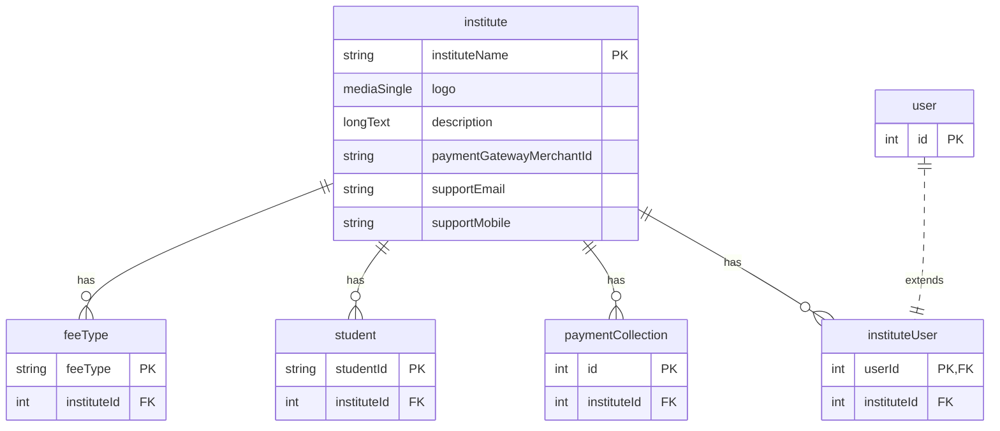

# Institute Model

**Business Purpose:** Represents an educational institution that will use the platform. It stores details like the institute's name, branding, contact information, and payment gateway configuration.

**Fields:**

| Field Name | Type | Description |
|---|---|---|
| `instituteName` | `shortText` | The official name of the institute. Marked as the user key. |
| `logo` | `mediaSingle` | The institute's logo for branding. |
| `description` | `longText` | A brief description of the institute. |
| `paymentGatewayMerchantId` | `shortText` | Merchant ID for the payment gateway. |
| `paymentGatewayAccessKey` | `shortText` | Access key for the payment gateway. |
| `paymentGatewayAccessSecret` | `shortText` | Secret key for the payment gateway. |
| `instituteAddress` | `longText` | The physical address of the institute. |
| `feeTypes` | `relation` | One-to-many relationship with Fee Types. |
| `instituteUsers` | `relation` | One-to-many relationship with Institute Users. |
| `instituteBrochure` | `mediaSingle` | A brochure or informational document. |
| `instituteIntroVideo` | `mediaSingle` | An introductory video for the institute. |
| `supportEmail` | `shortText` | Email address for support queries. |
| `supportMobile` | `shortText` | Mobile number for support queries. |
| `gst` | `shortText` | GST number of the institute. |
| `tnC` | `richText` | Terms and Conditions for the institute. |
| `faqs` | `richText` | Frequently Asked Questions. |
| `privacyPolicy` | `richText` | The institute's privacy policy. |
| `emailDomain` | `shortText` | The official email domain of the institute. |
| `custUserId` | `shortText` | Customer User ID for the institute. |

**ER Diagram:**



**institute**


<details>
<summary>&emsp; View Metadata JSON</summary>

```json
{
  "singularName": "institute",
  "pluralName": "institutes",
  "displayName": "Institute",
  "description": "The institute name...",
  "dataSource": "default",
  "dataSourceType": "postgres",
  "tableName": "fees_portal_institute",
  "userKeyFieldUserKey": "instituteName",
  "isChild": false,
  "enableAuditTracking": true,
  "enableSoftDelete": false,
  "draftPublishWorkflow": false,
  "internationalisation": false,
  "fields": [
    {
      "name": "instituteName",
      "displayName": "Institute Name",
      "description": null,
      "type": "shortText",
      "ormType": "varchar",
      "isSystem": false,
      "defaultValue": null,
      "min": null,
      "max": null,
      "required": true,
      "unique": true,
      "index": true,
      "private": false,
      "encrypt": false,
      "encryptionType": null,
      "decryptWhen": null,
      "columnName": null,
      "isUserKey": true,
      "enableAuditTracking": true
    },
    {
      "name": "logo",
      "displayName": "Logo",
      "description": null,
      "type": "mediaSingle",
      "ormType": "varchar",
      "isSystem": false,
      "mediaTypes": [
        "image"
      ],
      "mediaMaxSizeKb": 5120,
      "required": true,
      "unique": false,
      "index": false,
      "private": false,
      "encrypt": false,
      "encryptionType": null,
      "decryptWhen": null,
      "columnName": null,
      "mediaStorageProviderUserKey": "default-aws-s3"
    },
    {
      "name": "description",
      "displayName": "Description",
      "description": null,
      "type": "longText",
      "ormType": "text",
      "isSystem": false,
      "regexPattern": "",
      "regexPatternNotMatchingErrorMsg": "",
      "defaultValue": null,
      "min": null,
      "max": null,
      "required": false,
      "unique": false,
      "index": false,
      "private": false,
      "encrypt": false,
      "encryptionType": null,
      "decryptWhen": null,
      "columnName": null
    },
    {
      "name": "paymentGatewayMerchantId",
      "displayName": "Cust Code",
      "description": null,
      "type": "shortText",
      "ormType": "varchar",
      "isSystem": false,
      "defaultValue": null,
      "min": null,
      "max": null,
      "required": true,
      "unique": true,
      "index": false,
      "private": false,
      "encrypt": false,
      "encryptionType": null,
      "decryptWhen": null,
      "columnName": null,
      "isUserKey": false,
      "enableAuditTracking": true
    },
    {
      "name": "paymentGatewayAccessKey",
      "displayName": "Access Key",
      "description": null,
      "type": "shortText",
      "ormType": "varchar",
      "isSystem": false,
      "defaultValue": null,
      "min": null,
      "max": null,
      "required": true,
      "unique": true,
      "index": false,
      "private": false,
      "encrypt": false,
      "encryptionType": null,
      "decryptWhen": null,
      "columnName": null,
      "isUserKey": false,
      "enableAuditTracking": true
    },
    {
      "name": "paymentGatewayAccessSecret",
      "displayName": "Access Secret",
      "description": null,
      "type": "shortText",
      "ormType": "varchar",
      "isSystem": false,
      "defaultValue": null,
      "min": null,
      "max": null,
      "required": true,
      "unique": false,
      "index": false,
      "private": false,
      "encrypt": false,
      "encryptionType": null,
      "decryptWhen": null,
      "columnName": null,
      "isUserKey": false,
      "enableAuditTracking": true
    },
    {
      "name": "instituteAddress",
      "displayName": "Institute Address",
      "description": null,
      "type": "longText",
      "ormType": "text",
      "isSystem": false,
      "regexPattern": "",
      "regexPatternNotMatchingErrorMsg": "",
      "defaultValue": null,
      "min": null,
      "max": null,
      "required": false,
      "unique": false,
      "index": false,
      "private": false,
      "encrypt": false,
      "encryptionType": null,
      "decryptWhen": null,
      "columnName": null
    },
    {
      "name": "feeTypes",
      "displayName": "FeeTypes",
      "description": "FeeTypes",
      "type": "relation",
      "ormType": "integer",
      "isSystem": false,
      "relationType": "one-to-many",
      "relationCoModelFieldName": "institute",
      "relationCreateInverse": true,
      "relationCoModelSingularName": "feeType",
      "relationCoModelColumnName": null,
      "relationModelModuleName": "fees-portal",
      "relationCascade": "cascade",
      "required": false,
      "unique": false,
      "index": false,
      "private": false,
      "encrypt": false,
      "encryptionType": null,
      "decryptWhen": null,
      "columnName": null,
      "relationJoinTableName": null,
      "isRelationManyToManyOwner": null,
      "relationFieldFixedFilter": "",
      "enableAuditTracking": true
    },
    {
      "name": "instituteUsers",
      "displayName": "InstituteUsers",
      "description": "InstituteUsers",
      "type": "relation",
      "ormType": "integer",
      "isSystem": false,
      "relationType": "one-to-many",
      "relationCoModelFieldName": "institute",
      "relationCreateInverse": true,
      "relationCoModelSingularName": "instituteUser",
      "relationCoModelColumnName": null,
      "relationModelModuleName": "fees-portal",
      "relationCascade": "cascade",
      "required": false,
      "unique": false,
      "index": false,
      "private": false,
      "encrypt": false,
      "encryptionType": null,
      "decryptWhen": null,
      "columnName": null,
      "relationJoinTableName": null,
      "isRelationManyToManyOwner": null,
      "relationFieldFixedFilter": "",
      "enableAuditTracking": true
    },
    {
      "name": "instituteBrochure",
      "displayName": "Institute Brochure",
      "description": null,
      "type": "mediaSingle",
      "ormType": "varchar",
      "isSystem": false,
      "mediaTypes": [
        "file"
      ],
      "mediaMaxSizeKb": 5120,
      "required": false,
      "unique": false,
      "index": false,
      "private": false,
      "encrypt": false,
      "encryptionType": null,
      "decryptWhen": null,
      "columnName": null,
      "mediaStorageProviderUserKey": "default-aws-s3"
    },
    {
      "name": "instituteIntroVideo",
      "displayName": "Institute Intro Video",
      "description": null,
      "type": "mediaSingle",
      "ormType": "varchar",
      "isSystem": false,
      "mediaTypes": [
        "video"
      ],
      "mediaMaxSizeKb": 5120,
      "required": false,
      "unique": false,
      "index": false,
      "private": false,
      "encrypt": false,
      "encryptionType": null,
      "decryptWhen": null,
      "columnName": null,
      "mediaStorageProviderUserKey": "default-filesystem"
    },
    {
      "name": "supportEmail",
      "displayName": "Support Email",
      "description": null,
      "type": "shortText",
      "ormType": "varchar",
      "isSystem": false,
      "defaultValue": null,
      "min": null,
      "max": null,
      "required": true,
      "unique": false,
      "index": false,
      "private": false,
      "encrypt": false,
      "encryptionType": null,
      "decryptWhen": null,
      "columnName": null,
      "isUserKey": false,
      "enableAuditTracking": true
    },
    {
      "name": "supportMobile",
      "displayName": "Support Mobile",
      "description": null,
      "type": "shortText",
      "ormType": "varchar",
      "isSystem": false,
      "defaultValue": null,
      "min": 10,
      "max": 10,
      "required": true,
      "unique": false,
      "index": false,
      "private": false,
      "encrypt": false,
      "encryptionType": null,
      "decryptWhen": null,
      "columnName": null,
      "isUserKey": false,
      "enableAuditTracking": true
    },
    {
      "name": "gst",
      "displayName": "GST",
      "description": null,
      "type": "shortText",
      "ormType": "varchar",
      "isSystem": false,
      "defaultValue": null,
      "min": null,
      "max": null,
      "required": false,
      "unique": false,
      "index": false,
      "private": false,
      "encrypt": false,
      "encryptionType": null,
      "decryptWhen": null,
      "columnName": null,
      "isUserKey": false,
      "enableAuditTracking": true
    },
    {
      "name": "tnC",
      "displayName": "Terms and Conditions",
      "description": null,
      "type": "richText",
      "ormType": "text",
      "isSystem": false,
      "required": false,
      "unique": false,
      "index": false,
      "private": false,
      "encrypt": false,
      "encryptionType": null,
      "decryptWhen": null,
      "columnName": null
    },
    {
      "name": "faqs",
      "displayName": "FAQS",
      "description": null,
      "type": "richText",
      "ormType": "text",
      "isSystem": false,
      "required": false,
      "unique": false,
      "index": false,
      "private": false,
      "encrypt": false,
      "encryptionType": null,
      "decryptWhen": null,
      "columnName": null
    },
    {
      "name": "privacyPolicy",
      "displayName": "Privacy Policy",
      "description": null,
      "type": "richText",
      "ormType": "text",
      "isSystem": false,
      "required": false,
      "unique": false,
      "index": false,
      "private": false,
      "encrypt": false,
      "encryptionType": null,
      "decryptWhen": null,
      "columnName": null
    },
    {
      "name": "emailDomain",
      "displayName": "Email Domain",
      "description": null,
      "type": "shortText",
      "ormType": "varchar",
      "isSystem": false,
      "defaultValue": null,
      "min": null,
      "max": null,
      "required": false,
      "unique": false,
      "index": false,
      "private": false,
      "encrypt": false,
      "encryptionType": null,
      "decryptWhen": null,
      "columnName": null,
      "isUserKey": false,
      "enableAuditTracking": true
    },
    {
      "name": "custUserId",
      "displayName": "Cust UserID",
      "description": "Customer UserID",
      "type": "shortText",
      "ormType": "varchar",
      "isSystem": false,
      "defaultValue": null,
      "min": null,
      "max": null,
      "required": true,
      "unique": false,
      "index": false,
      "private": false,
      "encrypt": false,
      "encryptionType": null,
      "decryptWhen": null,
      "columnName": null,
      "isUserKey": false,
      "enableAuditTracking": false
    }
  ]
}
```

</details>


**Apply Changes:** Apply model changes as guided in Data Modeling page.