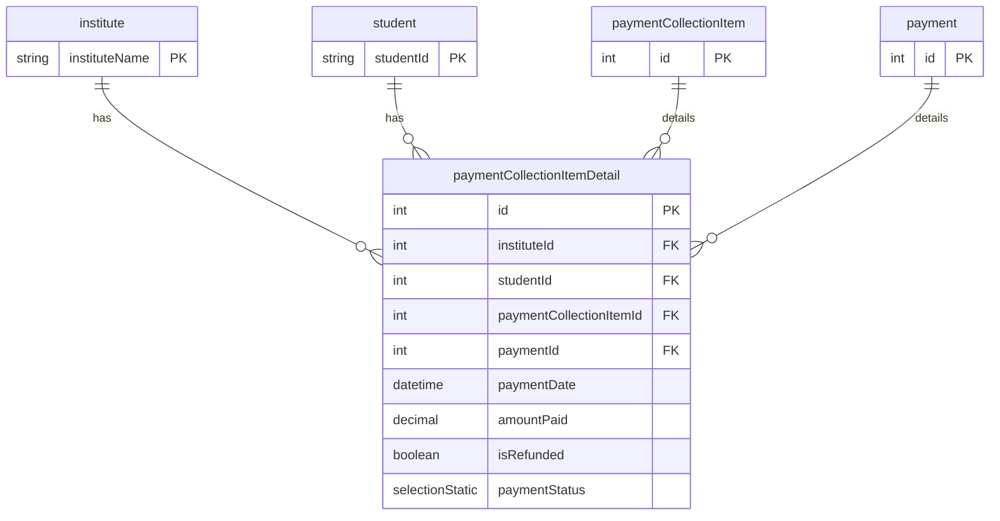

# Payment Collection Item Detail Model

**Business Purpose:** Stores the breakdown of a payment, linking a payment transaction to one or more fee items. This is useful for partial payments.

**Fields:**

| Field Name | Type | Description |
|---|---|---|
| `institute` | `relation` | Many-to-one relationship to the `institute` model. |
| `student` | `relation` | Many-to-one relationship to the `student` model. |
| `paymentCollectionItem` | `relation` | Many-to-one relationship to the `paymentCollectionItem` model. |
| `paymentDate` | `datetime` | The date and time of the payment. |
| `amountPaid` | `decimal` | The amount paid in this transaction. |
| `isRefunded` | `boolean` | A flag indicating if this portion of the payment was refunded. |
| `paymentStatus` | `selectionStatic` | The status of this payment detail (e.g., Succeeded, Failed). |
| `payment` | `relation` | Many-to-one relationship to the `payment` model. |

**ER Diagram:**




**payment-collection-item-detail**


**Metadata JSON:**

<details>
<summary>&emsp; View Metadata JSON</summary>

```json
{
  "singularName": "paymentCollectionItemDetail",
  "pluralName": "paymentCollectionItemDetails",
  "displayName": "Payment Collection Item Detail",
  "description": "This table allows us to store payment collection detail of user",
  "dataSource": "default",
  "dataSourceType": "postgres",
  "tableName": "fees_portal_payment_collection_item_detail",
  "isChild": false,
  "enableAuditTracking": true,
  "enableSoftDelete": false,
  "draftPublishWorkflow": false,
  "internationalisation": false,
  "fields": [
    {
      "name": "institute",
      "displayName": "Institute",
      "description": null,
      "type": "relation",
      "ormType": "integer",
      "isSystem": false,
      "relationType": "many-to-one",
      "relationCoModelFieldName": null,
      "relationCreateInverse": false,
      "relationCoModelSingularName": "institute",
      "relationCoModelColumnName": null,
      "relationModelModuleName": "fees-portal",
      "relationCascade": "cascade",
      "required": true,
      "unique": false,
      "index": false,
      "private": false,
      "encrypt": false,
      "encryptionType": null,
      "decryptWhen": null,
      "columnName": null,
      "relationJoinTableName": null,
      "isRelationManyToManyOwner": null,
      "relationFieldFixedFilter": "",
      "enableAuditTracking": true
    },
    {
      "name": "student",
      "displayName": "Student",
      "description": null,
      "type": "relation",
      "ormType": "integer",
      "isSystem": false,
      "relationType": "many-to-one",
      "relationCoModelFieldName": null,
      "relationCreateInverse": false,
      "relationCoModelSingularName": "student",
      "relationCoModelColumnName": null,
      "relationModelModuleName": "fees-portal",
      "relationCascade": "cascade",
      "required": true,
      "unique": false,
      "index": false,
      "private": false,
      "encrypt": false,
      "encryptionType": null,
      "decryptWhen": null,
      "columnName": null,
      "relationJoinTableName": null,
      "isRelationManyToManyOwner": null,
      "relationFieldFixedFilter": "",
      "enableAuditTracking": true
    },
    {
      "name": "paymentCollectionItem",
      "displayName": "Payment Collection Item",
      "description": null,
      "type": "relation",
      "ormType": "integer",
      "isSystem": false,
      "relationType": "many-to-one",
      "relationCoModelFieldName": "paymentCollectionItemDetails",
      "relationCreateInverse": true,
      "relationCoModelSingularName": "paymentCollectionItem",
      "relationCoModelColumnName": null,
      "relationModelModuleName": "fees-portal",
      "relationCascade": "cascade",
      "required": true,
      "unique": false,
      "index": false,
      "private": false,
      "encrypt": false,
      "encryptionType": null,
      "decryptWhen": null,
      "columnName": null,
      "relationJoinTableName": null,
      "isRelationManyToManyOwner": null,
      "relationFieldFixedFilter": "",
      "enableAuditTracking": true
    },
    {
      "name": "paymentDate",
      "displayName": "Payment Date",
      "description": null,
      "type": "datetime",
      "ormType": "timestamp",
      "isSystem": false,
      "defaultValue": null,
      "required": true,
      "unique": false,
      "index": false,
      "private": false,
      "encrypt": false,
      "encryptionType": null,
      "decryptWhen": null,
      "columnName": null,
      "enableAuditTracking": true
    },
    {
      "name": "isRefunded",
      "displayName": "Is Refunded",
      "description": null,
      "type": "boolean",
      "ormType": "boolean",
      "isSystem": false,
      "defaultValue": null,
      "required": false,
      "index": false,
      "private": false,
      "encrypt": false,
      "encryptionType": null,
      "decryptWhen": null,
      "columnName": null,
      "enableAuditTracking": true
    },
    {
      "name": "paymentStatus",
      "displayName": "Payment Status",
      "description": null,
      "type": "selectionStatic",
      "ormType": "varchar",
      "isSystem": false,
      "defaultValue": "Pending",
      "selectionStaticValues": [
        "Pending:Pending",
        "Succeeded:Succeeded",
        "Failed:Failed"
      ],
      "selectionValueType": "string",
      "required": true,
      "unique": false,
      "index": false,
      "private": false,
      "encrypt": false,
      "encryptionType": null,
      "decryptWhen": null,
      "columnName": null,
      "enableAuditTracking": true,
      "isMultiSelect": false
    },
    {
      "name": "payment",
      "displayName": "Payment",
      "description": null,
      "type": "relation",
      "ormType": "integer",
      "isSystem": false,
      "relationType": "many-to-one",
      "relationCoModelFieldName": "paymentCollectionItemDetails",
      "relationCreateInverse": true,
      "relationCoModelSingularName": "payment",
      "relationCoModelColumnName": null,
      "relationModelModuleName": "fees-portal",
      "relationCascade": "cascade",
      "required": true,
      "unique": false,
      "index": false,
      "private": false,
      "encrypt": false,
      "encryptionType": null,
      "decryptWhen": null,
      "columnName": null,
      "relationJoinTableName": null,
      "isRelationManyToManyOwner": null,
      "relationFieldFixedFilter": "",
      "enableAuditTracking": true
    },
    {
      "name": "amountPaid",
      "displayName": "Amount Paid",
      "description": null,
      "type": "decimal",
      "ormType": "decimal",
      "isSystem": false,
      "defaultValue": null,
      "min": null,
      "max": null,
      "required": true,
      "unique": false,
      "index": false,
      "private": false,
      "encrypt": false,
      "encryptionType": null,
      "decryptWhen": null,
      "columnName": null,
      "enableAuditTracking": true
    }
  ]
}
```

</details>

**Apply Changes:** Apply model changes as guided in Data Modeling page.