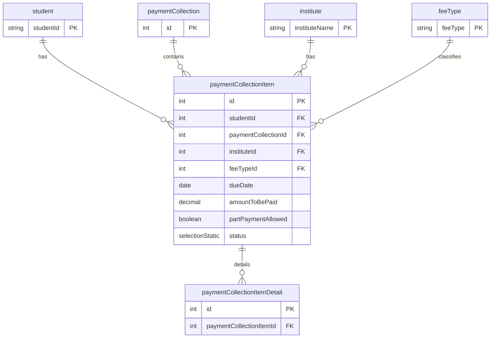

# Payment Collection Item Model

**Business Purpose:** Represents an individual fee item within a payment collection, linked to a specific student and fee type.

**Fields:**

| Field Name | Type | Description |
|---|---|---|
| `student` | `relation` | Many-to-one relationship to the `student` model. |
| `paymentCollection` | `relation` | Many-to-one relationship to the `paymentCollection` model. |
| `institute` | `relation` | Many-to-one relationship to the `institute` model. |
| `feeType` | `relation` | Many-to-one relationship to the `feeType` model. |
| `dueDate` | `date` | The due date for this specific fee item. |
| `amountToBePaid` | `decimal` | The amount to be paid for this fee item. |
| `partPaymentAllowed` | `boolean` | Whether partial payment is allowed. |
| `status` | `selectionStatic` | The payment status (e.g., Pending, Partially Paid, Fully Paid). |
| `amountPaid` | `computed` | The total amount paid, computed from related payment details. |
| `amountPending` | `computed` | The remaining amount to be paid. |
| `isOverdue` | `boolean` | A flag indicating if the payment is overdue. |
| `overdueByDays` | `int` | The number of days the payment is overdue. |
| `paymentCollectionItemDetails` | `relation` | One-to-many relationship to `paymentCollectionItemDetail`. |
| `lateAmountToBePaid` | `decimal` | The late fee amount to be paid. |
| `totalAmountToBePaid` | `computed` | The total amount including late fees. |
| `mode` | `shortText` | The mode of payment. |

**ER Diagram:**




**payment-collection-item**


**Metadata JSON:**

<details>
<summary>&emsp; View Metadata JSON</summary>

```json
{
  "singularName": "paymentCollectionItem",
  "pluralName": "paymentCollectionItems",
  "displayName": "Payment Collection Item",
  "description": "This table allows us to store payment collections collected from user",
  "dataSource": "default",
  "dataSourceType": "postgres",
  "tableName": "fees_portal_payment_collection_item",
  "isChild": false,
  "enableAuditTracking": true,
  "enableSoftDelete": false,
  "draftPublishWorkflow": false,
  "internationalisation": false,
  "fields": [
    {
      "name": "student",
      "displayName": "Student",
      "description": null,
      "type": "relation",
      "ormType": "integer",
      "isSystem": false,
      "relationType": "many-to-one",
      "relationCoModelFieldName": null,
      "relationCreateInverse": false,
      "relationCoModelSingularName": "student",
      "relationCoModelColumnName": null,
      "relationModelModuleName": "fees-portal",
      "relationCascade": "cascade",
      "required": true,
      "unique": false,
      "index": false,
      "private": false,
      "encrypt": false,
      "encryptionType": null,
      "decryptWhen": null,
      "columnName": null,
      "relationJoinTableName": null,
      "isRelationManyToManyOwner": null,
      "relationFieldFixedFilter": "",
      "enableAuditTracking": true
    },
    {
      "name": "paymentCollection",
      "displayName": "Payment Collection",
      "description": null,
      "type": "relation",
      "ormType": "integer",
      "isSystem": false,
      "relationType": "many-to-one",
      "relationCoModelFieldName": "paymentCollectionItems",
      "relationCreateInverse": true,
      "relationCoModelSingularName": "paymentCollection",
      "relationCoModelColumnName": null,
      "relationModelModuleName": "fees-portal",
      "relationCascade": "cascade",
      "required": true,
      "unique": false,
      "index": false,
      "private": false,
      "encrypt": false,
      "encryptionType": null,
      "decryptWhen": null,
      "columnName": null,
      "relationJoinTableName": null,
      "isRelationManyToManyOwner": null,
      "relationFieldFixedFilter": "",
      "enableAuditTracking": true
    },
    {
      "name": "institute",
      "displayName": "Institute",
      "description": null,
      "type": "relation",
      "ormType": "integer",
      "isSystem": false,
      "relationType": "many-to-one",
      "relationCoModelFieldName": null,
      "relationCreateInverse": false,
      "relationCoModelSingularName": "institute",
      "relationCoModelColumnName": null,
      "relationModelModuleName": "fees-portal",
      "relationCascade": "cascade",
      "required": true,
      "unique": false,
      "index": false,
      "private": false,
      "encrypt": false,
      "encryptionType": null,
      "decryptWhen": null,
      "columnName": null,
      "relationJoinTableName": null,
      "isRelationManyToManyOwner": null,
      "relationFieldFixedFilter": "",
      "enableAuditTracking": true
    },
    {
      "name": "feeType",
      "displayName": "Fee Type",
      "description": null,
      "type": "relation",
      "ormType": "integer",
      "isSystem": false,
      "relationType": "many-to-one",
      "relationCoModelFieldName": null,
      "relationCreateInverse": false,
      "relationCoModelSingularName": "feeType",
      "relationCoModelColumnName": null,
      "relationModelModuleName": "fees-portal",
      "relationCascade": "cascade",
      "required": true,
      "unique": false,
      "index": false,
      "private": false,
      "encrypt": false,
      "encryptionType": null,
      "decryptWhen": null,
      "columnName": null,
      "relationJoinTableName": null,
      "isRelationManyToManyOwner": null,
      "relationFieldFixedFilter": "",
      "enableAuditTracking": true
    },
    {
      "name": "dueDate",
      "displayName": "Due date",
      "description": null,
      "type": "date",
      "ormType": "date",
      "isSystem": false,
      "defaultValue": null,
      "required": true,
      "unique": false,
      "index": false,
      "private": false,
      "encrypt": false,
      "encryptionType": null,
      "decryptWhen": null,
      "columnName": null,
      "enableAuditTracking": true
    },
    {
      "name": "partPaymentAllowed",
      "displayName": "Part Payment Allowed",
      "description": null,
      "type": "boolean",
      "ormType": "boolean",
      "isSystem": false,
      "defaultValue": null,
      "required": true,
      "index": false,
      "private": false,
      "encrypt": false,
      "encryptionType": null,
      "decryptWhen": null,
      "columnName": null,
      "enableAuditTracking": true
    },
    {
      "name": "status",
      "displayName": "Status",
      "description": null,
      "type": "selectionStatic",
      "ormType": "varchar",
      "isSystem": false,
      "defaultValue": "Pending",
      "selectionStaticValues": [
        "Pending:Pending",
        "Partially Paid:Partially Paid",
        "Fully Paid:Fully Paid",
        "Cancelled:Cancelled"
      ],
      "selectionValueType": "string",
      "required": true,
      "unique": false,
      "index": false,
      "private": false,
      "encrypt": false,
      "encryptionType": null,
      "decryptWhen": null,
      "columnName": null,
      "enableAuditTracking": true,
      "isMultiSelect": false
    },
    {
      "name": "isOverdue",
      "displayName": "Is Overdue",
      "description": null,
      "type": "boolean",
      "ormType": "boolean",
      "isSystem": false,
      "defaultValue": null,
      "required": true,
      "index": false,
      "private": false,
      "encrypt": false,
      "encryptionType": null,
      "decryptWhen": null,
      "columnName": null,
      "enableAuditTracking": true
    },
    {
      "name": "overdueByDays",
      "displayName": "Overdue By Days",
      "description": null,
      "type": "int",
      "ormType": "integer",
      "isSystem": false,
      "defaultValue": null,
      "min": null,
      "max": null,
      "required": true,
      "unique": false,
      "index": false,
      "private": false,
      "encrypt": false,
      "encryptionType": null,
      "decryptWhen": null,
      "columnName": null,
      "enableAuditTracking": true
    },
    {
      "name": "paymentCollectionItemDetails",
      "displayName": "PaymentCollectionItemDetails",
      "description": "PaymentCollectionItemDetails",
      "type": "relation",
      "ormType": "integer",
      "isSystem": false,
      "relationType": "one-to-many",
      "relationCoModelFieldName": "paymentCollectionItem",
      "relationCreateInverse": true,
      "relationCoModelSingularName": "paymentCollectionItemDetail",
      "relationCoModelColumnName": null,
      "relationModelModuleName": "fees-portal",
      "relationCascade": "cascade",
      "required": false,
      "unique": false,
      "index": false,
      "private": false,
      "encrypt": false,
      "encryptionType": null,
      "decryptWhen": null,
      "columnName": null,
      "relationJoinTableName": null,
      "isRelationManyToManyOwner": null,
      "relationFieldFixedFilter": "",
      "enableAuditTracking": true
    },
    {
      "name": "lateAmountToBePaid",
      "displayName": "Late Amount To Be Paid",
      "description": null,
      "type": "decimal",
      "ormType": "decimal",
      "isSystem": false,
      "defaultValue": null,
      "min": null,
      "max": null,
      "required": false,
      "unique": false,
      "index": false,
      "private": false,
      "encrypt": false,
      "encryptionType": null,
      "decryptWhen": null,
      "columnName": null,
      "enableAuditTracking": true
    },
    {
      "name": "amountPaid",
      "displayName": "Amount Paid",
      "description": null,
      "type": "computed",
      "ormType": "varchar",
      "isSystem": false,
      "computedFieldValueType": "decimal",
      "computedFieldTriggerConfig": [
        {
          "modelName": "paymentCollectionItemDetail",
          "moduleName": "fees-portal",
          "operations": [
            "after-update"
          ]
        }
      ],
      "computedFieldValueProvider": "PaymentCollectionItemAmountProvider",
      "computedFieldValueProviderCtxt": "{}",
      "required": true,
      "unique": false,
      "index": false,
      "private": false,
      "encrypt": false,
      "encryptionType": null,
      "decryptWhen": null,
      "columnName": null,
      "isUserKey": false
    },
    {
      "name": "amountToBePaid",
      "displayName": "Amount To Be Paid",
      "description": null,
      "type": "decimal",
      "ormType": "decimal",
      "isSystem": false,
      "defaultValue": null,
      "min": null,
      "max": null,
      "required": false,
      "unique": false,
      "index": false,
      "private": false,
      "encrypt": false,
      "encryptionType": null,
      "decryptWhen": null,
      "columnName": null,
      "enableAuditTracking": true
    },
    {
      "name": "amountPending",
      "displayName": "Amount Pending",
      "description": null,
      "type": "computed",
      "ormType": "varchar",
      "isSystem": false,
      "computedFieldValueType": "decimal",
      "computedFieldTriggerConfig": [
        {
          "modelName": "paymentCollectionItemDetail",
          "moduleName": "fees-portal",
          "operations": [
            "before-insert"
          ]
        }
      ],
      "computedFieldValueProvider": "NoopsEntityComputedFieldProviderService",
      "computedFieldValueProviderCtxt": "{}",
      "required": true,
      "unique": false,
      "index": false,
      "private": false,
      "encrypt": false,
      "encryptionType": null,
      "decryptWhen": null,
      "columnName": null,
      "isUserKey": false
    },
    {
      "name": "totalAmountToBePaid",
      "displayName": "Total Amount To Be Paid",
      "description": null,
      "type": "computed",
      "ormType": "varchar",
      "isSystem": false,
      "computedFieldValueType": "decimal",
      "computedFieldTriggerConfig": [
        {
          "modelName": "paymentCollectionItemDetail",
          "moduleName": "fees-portal",
          "operations": [
            "before-insert"
          ]
        }
      ],
      "computedFieldValueProvider": "NoopsEntityComputedFieldProviderService",
      "computedFieldValueProviderCtxt": "{}",
      "required": false,
      "unique": false,
      "index": false,
      "private": false,
      "encrypt": false,
      "encryptionType": null,
      "decryptWhen": null,
      "columnName": null,
      "isUserKey": false
    },
    {
      "name": "mode",
      "displayName": "Mode",
      "description": "Mode",
      "type": "shortText",
      "ormType": "varchar",
      "isSystem": false,
      "defaultValue": null,
      "min": null,
      "max": null,
      "required": false,
      "unique": false,
      "index": false,
      "private": false,
      "encrypt": false,
      "encryptionType": null,
      "decryptWhen": null,
      "columnName": null,
      "isUserKey": false,
      "enableAuditTracking": true
    }
  ]
}
```

</details>

**Apply Changes:** Apply model changes as guided in Data Modeling page.