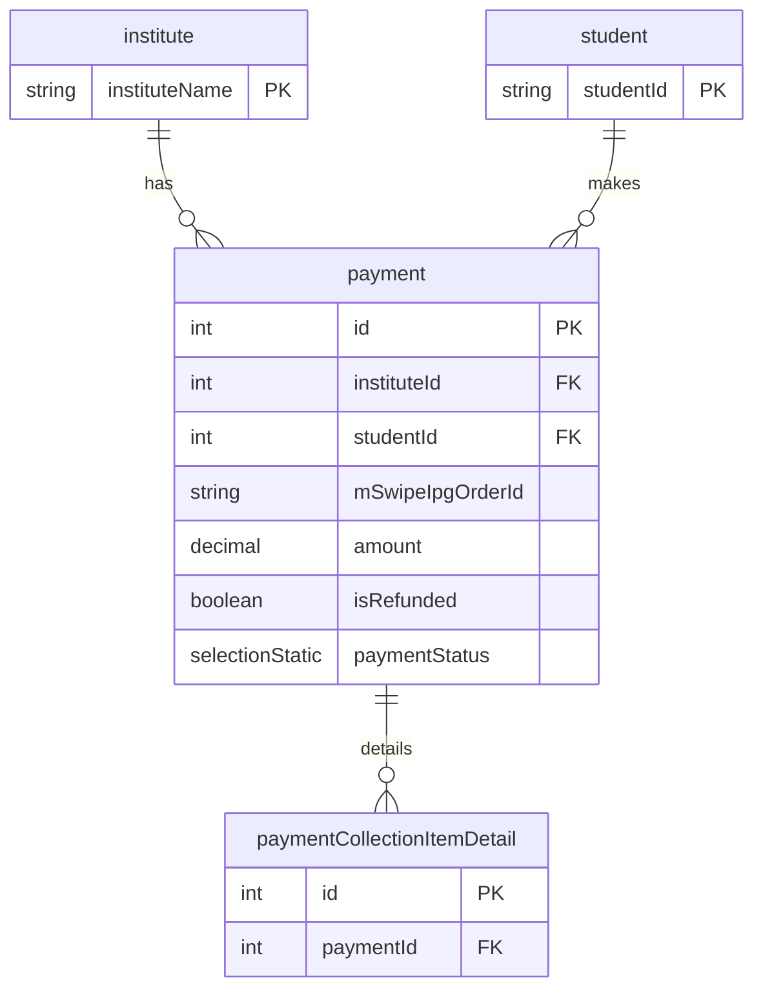

# Payment Model

**Business Purpose:** Records the details of a payment transaction, including gateway-specific IDs and the payment status.

**Fields:**

| Field Name | Type | Description |
|---|---|---|
| `institute` | `relation` | Many-to-one relationship to the `institute` model. |
| `student` | `relation` | Many-to-one relationship to the `student` model. |
| `mSwipeIpgOrderId` | `shortText` | Order ID from the M-Swipe payment gateway. |
| `mSwipeIpgPaymentId` | `shortText` | Payment ID from the M-Swipe payment gateway. |
| `mSwipeIpgTransId` | `shortText` | Transaction ID from the M-Swipe payment gateway. |
| `mSwipeIpgInvoiceId` | `shortText` | Invoice ID from the M-Swipe payment gateway. |
| `mSwipeEncodedIpgId` | `shortText` | Encoded ID from the M-Swipe payment gateway. |
| `mSwipeIpgStatus` | `shortText` | Status from the M-Swipe payment gateway. |
| `amount` | `decimal` | The amount of the payment. |
| `isRefunded` | `boolean` | A flag indicating if the payment has been refunded. |
| `paymentStatus` | `selectionStatic` | The status of the payment (e.g., Pending, Succeeded, Failed). |
| `paymentCollectionItemDetails` | `relation` | One-to-many relationship to `paymentCollectionItemDetail`. |

**ER Diagram:**




**payment**


**Metadata JSON:**

<details>
<summary>&emsp; View Metadata JSON</summary>

```json
{
  "singularName": "payment",
  "pluralName": "payments",
  "displayName": "Payment",
  "description": "This table allows us to store payment records of a user",
  "dataSource": "default",
  "dataSourceType": "postgres",
  "tableName": "fees_portal_payment",
  "isChild": false,
  "enableAuditTracking": true,
  "enableSoftDelete": false,
  "draftPublishWorkflow": false,
  "internationalisation": false,
  "fields": [
    {
      "name": "institute",
      "displayName": "Institute",
      "description": null,
      "type": "relation",
      "ormType": "integer",
      "isSystem": false,
      "relationType": "many-to-one",
      "relationCoModelFieldName": null,
      "relationCreateInverse": false,
      "relationCoModelSingularName": "institute",
      "relationCoModelColumnName": null,
      "relationModelModuleName": "fees-portal",
      "relationCascade": "cascade",
      "required": true,
      "unique": false,
      "index": false,
      "private": false,
      "encrypt": false,
      "encryptionType": null,
      "decryptWhen": null,
      "columnName": null,
      "relationJoinTableName": null,
      "isRelationManyToManyOwner": null,
      "relationFieldFixedFilter": "",
      "enableAuditTracking": true
    },
    {
      "name": "student",
      "displayName": "Student",
      "description": null,
      "type": "relation",
      "ormType": "integer",
      "isSystem": false,
      "relationType": "many-to-one",
      "relationCoModelFieldName": "payments",
      "relationCreateInverse": true,
      "relationCoModelSingularName": "student",
      "relationCoModelColumnName": null,
      "relationModelModuleName": "fees-portal",
      "relationCascade": "cascade",
      "required": true,
      "unique": false,
      "index": false,
      "private": false,
      "encrypt": false,
      "encryptionType": null,
      "decryptWhen": null,
      "columnName": null,
      "relationJoinTableName": null,
      "isRelationManyToManyOwner": null,
      "relationFieldFixedFilter": "",
      "enableAuditTracking": true
    },
    {
      "name": "mSwipeIpgOrderId",
      "displayName": "M Swipe Ipg Order Id",
      "description": null,
      "type": "shortText",
      "ormType": "varchar",
      "isSystem": false,
      "defaultValue": null,
      "min": null,
      "max": null,
      "required": true,
      "unique": false,
      "index": false,
      "private": false,
      "encrypt": false,
      "encryptionType": null,
      "decryptWhen": null,
      "columnName": null,
      "isUserKey": false,
      "enableAuditTracking": true
    },
    {
      "name": "mSwipeIpgPaymentId",
      "displayName": "M Swipe Ipg Payment Id",
      "description": null,
      "type": "shortText",
      "ormType": "varchar",
      "isSystem": false,
      "defaultValue": null,
      "min": null,
      "max": null,
      "required": false,
      "unique": false,
      "index": false,
      "private": false,
      "encrypt": false,
      "encryptionType": null,
      "decryptWhen": null,
      "columnName": null,
      "isUserKey": false,
      "enableAuditTracking": true
    },
    {
      "name": "mSwipeIpgTransId",
      "displayName": "M Swipe Ipg Trans Id",
      "description": null,
      "type": "shortText",
      "ormType": "varchar",
      "isSystem": false,
      "defaultValue": null,
      "min": null,
      "max": null,
      "required": false,
      "unique": false,
      "index": false,
      "private": false,
      "encrypt": false,
      "encryptionType": null,
      "decryptWhen": null,
      "columnName": null,
      "isUserKey": false,
      "enableAuditTracking": true
    },
    {
      "name": "mSwipeIpgInvoiceId",
      "displayName": "M Swipe Ipg Invoice Id",
      "description": null,
      "type": "shortText",
      "ormType": "varchar",
      "isSystem": false,
      "defaultValue": null,
      "min": null,
      "max": null,
      "required": false,
      "unique": false,
      "index": false,
      "private": false,
      "encrypt": false,
      "encryptionType": null,
      "decryptWhen": null,
      "columnName": null,
      "isUserKey": false,
      "enableAuditTracking": true
    },
    {
      "name": "mSwipeEncodedIpgId",
      "displayName": "M Swipe Encoded Ipg Id",
      "description": null,
      "type": "shortText",
      "ormType": "varchar",
      "isSystem": false,
      "defaultValue": null,
      "min": null,
      "max": null,
      "required": false,
      "unique": false,
      "index": false,
      "private": false,
      "encrypt": false,
      "encryptionType": null,
      "decryptWhen": null,
      "columnName": null,
      "isUserKey": false,
      "enableAuditTracking": true
    },
    {
      "name": "mSwipeIpgStatus",
      "displayName": "M Swipe Ipg Status",
      "description": null,
      "type": "shortText",
      "ormType": "varchar",
      "isSystem": false,
      "defaultValue": null,
      "min": null,
      "max": null,
      "required": false,
      "unique": false,
      "index": false,
      "private": false,
      "encrypt": false,
      "encryptionType": null,
      "decryptWhen": null,
      "columnName": null,
      "isUserKey": false,
      "enableAuditTracking": true
    },
    {
      "name": "amount",
      "displayName": "Amount",
      "description": null,
      "type": "decimal",
      "ormType": "decimal",
      "isSystem": false,
      "defaultValue": null,
      "min": null,
      "max": null,
      "required": true,
      "unique": false,
      "index": false,
      "private": false,
      "encrypt": false,
      "encryptionType": null,
      "decryptWhen": null,
      "columnName": null,
      "enableAuditTracking": true
    },
    {
      "name": "isRefunded",
      "displayName": "Is Refunded",
      "description": null,
      "type": "boolean",
      "ormType": "boolean",
      "isSystem": false,
      "defaultValue": null,
      "required": true,
      "index": false,
      "private": false,
      "encrypt": false,
      "encryptionType": null,
      "decryptWhen": null,
      "columnName": null,
      "enableAuditTracking": true
    },
    {
      "name": "paymentStatus",
      "displayName": "Payment Status",
      "description": null,
      "type": "selectionStatic",
      "ormType": "varchar",
      "isSystem": false,
      "defaultValue": "Pending",
      "selectionStaticValues": [
        "Pending:Pending",
        "Succeeded:Succeeded",
        "Failed:Failed"
      ],
      "selectionValueType": "string",
      "required": true,
      "unique": false,
      "index": false,
      "private": false,
      "encrypt": false,
      "encryptionType": null,
      "decryptWhen": null,
      "columnName": null,
      "enableAuditTracking": true,
      "isMultiSelect": false
    },
    {
      "name": "paymentCollectionItemDetails",
      "displayName": "PaymentCollectionItemDetails",
      "description": "PaymentCollectionItemDetails",
      "type": "relation",
      "ormType": "integer",
      "isSystem": false,
      "relationType": "one-to-many",
      "relationCoModelFieldName": "payment",
      "relationCreateInverse": true,
      "relationCoModelSingularName": "paymentCollectionItemDetail",
      "relationCoModelColumnName": null,
      "relationModelModuleName": "fees-portal",
      "relationCascade": "cascade",
      "required": false,
      "unique": false,
      "index": false,
      "private": false,
      "encrypt": false,
      "encryptionType": null,
      "decryptWhen": null,
      "columnName": null,
      "relationJoinTableName": null,
      "isRelationManyToManyOwner": null,
      "relationFieldFixedFilter": "",
      "enableAuditTracking": true
    }
  ]
}
```

</details>

**Apply Changes:** Apply model changes as guided in Data Modeling page.