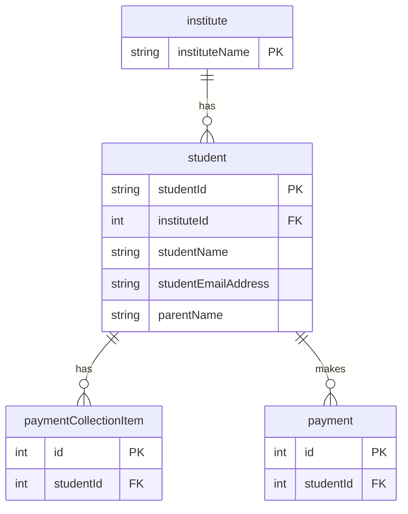

# Student Model

**Business Purpose:** Represents a student in an institute. This model stores personal and contact information for the student and their parent/guardian.

**Fields:**

| Field Name | Type | Description |
|---|---|---|
| `studentName` | `shortText` | The full name of the student. |
| `studentEmailAddress` | `shortText` | The student's email address. |
| `studentMobileNumber` | `shortText` | The student's mobile number. |
| `parentName` | `shortText` | The name of the parent or guardian. |
| `parentMobileNumber` | `shortText` | The parent's or guardian's mobile number. |
| `parentEmailAddress` | `shortText` | The parent's or guardian's email address. |
| `studentId` | `shortText` | The official student ID provided by the institute. |
| `institute` | `relation` | A many-to-one relationship to the `institute` model. |
| `payments` | `relation` | A one-to-many relationship to the `payment` model. |
| `otp` | `shortText` | One-time password for student/parent login. |
| `otpExpiresAt` | `datetime` | Expiry time for the OTP. |
| `token` | `longText` | Authentication token for the student/parent session. |
| `studentLoginId` | `computed` | A unique login ID for the student, computed from their name. |

**ER Diagram:**




**student**


**Metadata JSON:**

<details>
<summary>&emsp; View Metadata JSON</summary>

```json
{
  "singularName": "student",
  "pluralName": "students",
  "displayName": "Student",
  "description": "This table allows us to store student records institute wise",
  "dataSource": "default",
  "dataSourceType": "postgres",
  "tableName": "fees_portal_student",
  "userKeyFieldUserKey": "studentLoginId",
  "isChild": false,
  "enableAuditTracking": true,
  "enableSoftDelete": false,
  "draftPublishWorkflow": false,
  "internationalisation": false,
  "fields": [
    {
      "name": "studentName",
      "displayName": "Student Name",
      "description": null,
      "type": "shortText",
      "ormType": "varchar",
      "isSystem": false,
      "defaultValue": null,
      "min": null,
      "max": null,
      "required": true,
      "unique": false,
      "index": false,
      "private": false,
      "encrypt": false,
      "encryptionType": null,
      "decryptWhen": null,
      "columnName": null,
      "isUserKey": false,
      "enableAuditTracking": true
    },
    {
      "name": "studentEmailAddress",
      "displayName": "Student Email Address",
      "description": null,
      "type": "shortText",
      "ormType": "varchar",
      "isSystem": false,
      "defaultValue": null,
      "min": null,
      "max": null,
      "required": false,
      "unique": false,
      "index": false,
      "private": false,
      "encrypt": false,
      "encryptionType": null,
      "decryptWhen": null,
      "columnName": null,
      "isUserKey": false,
      "enableAuditTracking": true
    },
    {
      "name": "studentMobileNumber",
      "displayName": "Student Mobile Number",
      "description": null,
      "type": "shortText",
      "ormType": "varchar",
      "isSystem": false,
      "defaultValue": null,
      "min": null,
      "max": null,
      "required": false,
      "unique": false,
      "index": false,
      "private": false,
      "encrypt": false,
      "encryptionType": null,
      "decryptWhen": null,
      "columnName": null,
      "isUserKey": false,
      "enableAuditTracking": true
    },
    {
      "name": "parentName",
      "displayName": "Parent Name",
      "description": null,
      "type": "shortText",
      "ormType": "varchar",
      "isSystem": false,
      "defaultValue": null,
      "min": null,
      "max": null,
      "required": true,
      "unique": false,
      "index": false,
      "private": false,
      "encrypt": false,
      "encryptionType": null,
      "decryptWhen": null,
      "columnName": null,
      "isUserKey": false,
      "enableAuditTracking": true
    },
    {
      "name": "parentMobileNumber",
      "displayName": "Parent Mobile Number",
      "description": null,
      "type": "shortText",
      "ormType": "varchar",
      "isSystem": false,
      "defaultValue": null,
      "min": null,
      "max": null,
      "required": true,
      "unique": false,
      "index": false,
      "private": false,
      "encrypt": false,
      "encryptionType": null,
      "decryptWhen": null,
      "columnName": null,
      "isUserKey": false,
      "enableAuditTracking": true
    },
    {
      "name": "parentEmailAddress",
      "displayName": "Parent Email Address",
      "description": null,
      "type": "shortText",
      "ormType": "varchar",
      "isSystem": false,
      "defaultValue": null,
      "min": null,
      "max": null,
      "required": true,
      "unique": false,
      "index": false,
      "private": false,
      "encrypt": false,
      "encryptionType": null,
      "decryptWhen": null,
      "columnName": null,
      "isUserKey": false,
      "enableAuditTracking": true
    },
    {
      "name": "studentId",
      "displayName": "Student Id",
      "description": null,
      "type": "shortText",
      "ormType": "varchar",
      "isSystem": false,
      "defaultValue": null,
      "min": null,
      "max": null,
      "required": true,
      "unique": false,
      "index": false,
      "private": false,
      "encrypt": false,
      "encryptionType": null,
      "decryptWhen": null,
      "columnName": null,
      "isUserKey": false,
      "enableAuditTracking": true
    },
    {
      "name": "institute",
      "displayName": "Institute",
      "description": null,
      "type": "relation",
      "ormType": "integer",
      "isSystem": false,
      "relationType": "many-to-one",
      "relationCoModelFieldName": null,
      "relationCreateInverse": false,
      "relationCoModelSingularName": "institute",
      "relationCoModelColumnName": null,
      "relationModelModuleName": "fees-portal",
      "relationCascade": "cascade",
      "required": true,
      "unique": false,
      "index": false,
      "private": false,
      "encrypt": false,
      "encryptionType": null,
      "decryptWhen": null,
      "columnName": null,
      "relationJoinTableName": null,
      "isRelationManyToManyOwner": null,
      "relationFieldFixedFilter": "",
      "enableAuditTracking": true
    },
    {
      "name": "payments",
      "displayName": "Payments",
      "description": "Payments",
      "type": "relation",
      "ormType": "integer",
      "isSystem": false,
      "relationType": "one-to-many",
      "relationCoModelFieldName": "student",
      "relationCreateInverse": true,
      "relationCoModelSingularName": "payment",
      "relationCoModelColumnName": null,
      "relationModelModuleName": "fees-portal",
      "relationCascade": "cascade",
      "required": false,
      "unique": false,
      "index": false,
      "private": false,
      "encrypt": false,
      "encryptionType": null,
      "decryptWhen": null,
      "columnName": null,
      "relationJoinTableName": null,
      "isRelationManyToManyOwner": null,
      "relationFieldFixedFilter": "",
      "enableAuditTracking": true
    },
    {
      "name": "otp",
      "displayName": "Otp",
      "description": "This is used to store student otp",
      "type": "shortText",
      "ormType": "varchar",
      "isSystem": false,
      "defaultValue": null,
      "min": null,
      "max": null,
      "required": false,
      "unique": false,
      "index": false,
      "private": false,
      "encrypt": false,
      "encryptionType": null,
      "decryptWhen": null,
      "columnName": null,
      "isUserKey": false,
      "enableAuditTracking": true
    },
    {
      "name": "otpExpiresAt",
      "displayName": "Otp Expires At",
      "description": "This is the time when otp get expired",
      "type": "datetime",
      "ormType": "timestamp",
      "isSystem": false,
      "defaultValue": null,
      "required": false,
      "unique": false,
      "index": false,
      "private": false,
      "encrypt": false,
      "encryptionType": null,
      "decryptWhen": null,
      "columnName": null,
      "enableAuditTracking": true
    },
    {
      "name": "token",
      "displayName": "Token",
      "description": null,
      "type": "longText",
      "ormType": "text",
      "isSystem": false,
      "regexPattern": "",
      "regexPatternNotMatchingErrorMsg": "",
      "defaultValue": null,
      "min": null,
      "max": null,
      "required": false,
      "unique": false,
      "index": false,
      "private": false,
      "encrypt": false,
      "encryptionType": null,
      "decryptWhen": null,
      "columnName": null
    },
    {
      "name": "studentLoginId",
      "displayName": "Student Login ID",
      "description": "Student Login ID",
      "type": "computed",
      "ormType": "varchar",
      "isSystem": false,
      "computedFieldValueType": "string",
      "computedFieldTriggerConfig": [
        {
          "modelName": "student",
          "moduleName": "fees-portal",
          "operations": [
            "before-insert"
          ]
        }
      ],
      "computedFieldValueProvider": "AlphaNumExternalIdComputationProvider",
      "computedFieldValueProviderCtxt": "{
  \"dynamicFieldPrefix\": \"studentName\",
  \"length\": 5
}",
      "required": true,
      "unique": true,
      "index": false,
      "private": false,
      "encrypt": false,
      "encryptionType": null,
      "decryptWhen": null,
      "columnName": null,
      "isUserKey": true
    }
  ]
}
```

</details>

**Apply Changes:** Apply model changes as guided in Data Modeling page.