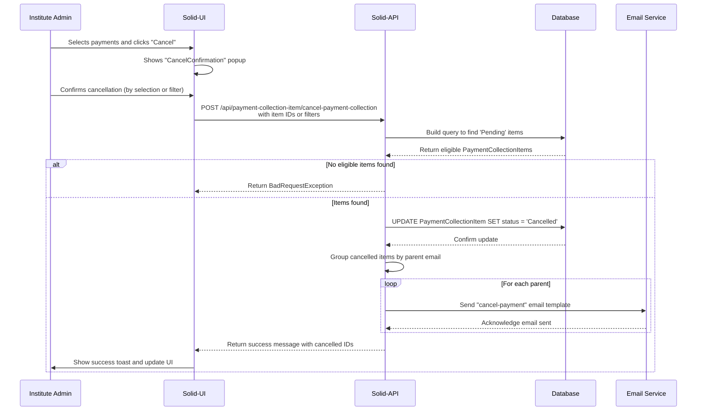

# Cancel Payment Workflow

In any financial system, flexibility is key. The Cancel Payment workflow provides Institute Administrators with the essential ability to reverse pending payment requests. This might be necessary due to data entry errors, duplicate requests, or changes in a student's enrollment status.

This guide details the user-facing methods for cancellation, the underlying backend logic, UI implementation steps for developers, and the key business and security rules governing the process.

## 1. The User Experience (For Institute Admins)

An Institute Admin can cancel payments using two distinct methods, providing flexibility for both targeted and bulk actions.

#### Method 1: Individual or Multiple Selection

For precise control, the admin can select one or more payment items directly from the list using checkboxes and then click the **"Cancel"** button. This is ideal for correcting specific, isolated errors.


#### Method 2: Bulk Cancellation by Filter

For broader actions, the admin can first apply filters (e.g., by student, date range, or fee type) to narrow down the list of payments.


After applying filters, clicking the **"Cancel"** button will trigger a confirmation pop-up. Confirming this action will cancel all items currently matching the filter criteria.


---

## 2. The Cancellation Process: A Technical Deep-Dive

This section breaks down the technical implementation of the cancellation workflow, from the API endpoint to the final email notification.

### Workflow Diagram

The following diagram illustrates the end-to-end cancellation sequence:



### Backend API Endpoint

The entire workflow is triggered by a `POST` request to the `/api/payment-collection-item/cancel-payment-collection` endpoint.

```typescript
// payment-collection-item.controller.ts
@ApiBearerAuth("jwt")
@Post("/cancel-payment-collection")
async cancelMany(@Body() body: { collectionIds: any[], ids: any[], filters?: any, modelName: string }) {
  return this.service.cancelPaymentCollectionItems(body.collectionIds, body.ids, body.filters || {}, body.modelName);
}
```

### Core Service Logic (`cancelPaymentCollectionItems`)

The `cancelPaymentCollectionItems` method in the service layer orchestrates the core logic.

#### a. Building the Query
The method first constructs a database query to identify the exact items to be cancelled. It intelligently combines filters from the UI with any provided `collectionIds` or `itemIds`, while strictly ensuring that only items with a `Pending` status are targeted.

#### b. Fetching and Validating Records
Next, it executes the query to fetch all eligible `PaymentCollectionItem` records. It also populates related data (student, institute, fee type) needed for the email notifications. If no pending items match the criteria, it throws a `BadRequestException`.

#### c. Bulk Update Operation
The service performs an efficient bulk update, changing the `status` of all identified items to `"Cancelled"` in a single database transaction. This is a critical step for performance, especially during large bulk cancellations.

#### d. Sending Email Notifications
After successfully updating the database, the system groups the cancelled items by the parent's email address. This ensures that each parent receives a single, consolidated email notification, even if multiple fee items for their child were cancelled. It then sends a templated email (`cancel-payment`) with the relevant details.

### Error Handling
The system is designed to handle several error scenarios gracefully:
-   **No Items Selected/Filtered:** If the admin tries to cancel without selecting any items or applying any filters, the backend will return a `400 Bad Request` error.
-   **No Eligible Items Found:** If the selected items or filters do not match any `Pending` payment items, the backend will return a `400 Bad Request` with the message "No eligible records found for cancellation."
-   **Unauthorized Access:** The API endpoint is protected by JWT authentication. Any request without a valid token will be rejected with a `401 Unauthorized` error.

---

## 3. Developer's Guide: UI Implementation

To implement this feature in the frontend, a developer needs to add the cancel button, create a custom confirmation component, and register it.

#### Step 1: Add the Cancel Button to the List View
Navigate to `Solid -> Layout Builder -> View -> PaymentCollection-List-View -> Layout` and add the following `headerButtons` attribute to the layout JSON:

```json
"headerButtons": [
  {
    "attrs": {
      "label": "Cancel",
      "action": "CancelConfirmation",
      "actionInContextMenu": false,
      "openInPopup": true,
      "icon": "pi pi-times",
      "className": "p-button-danger p-button p-component",
      "closable": true
    }
  }
]
```

#### Step 2: Register the Custom Action Component
In the `solid-ui > app > solid-extension.ts` file, register your custom React component to handle the `CancelConfirmation` action.

```typescript
// solid-ui/app/solid-extension.ts
import CancelConfirmation from './path/to/your/CancelConfirmation'; // Adjust the path

registerExtensionComponent('CancelConfirmation', CancelConfirmation);
```
:::tip
`registerExtensionComponent` makes your custom component available to the Solid-UI renderer, allowing it to be invoked by actions defined in the Layout Builder.
:::

#### Step 3: Create the `CancelConfirmation` Component
This React component will render a dialog asking the user to confirm whether they want to cancel the *selected* records or all *filtered* records.

<details>
<summary>Full Code for the <code>CancelConfirmation</code> Component</summary>

```jsx
// Example Implementation
import React, { useRef, useState } from "react";
import { Dialog } from "primereact/dialog";
import { RadioButton } from "primereact/radiobutton";
import { Button } from "primereact/button";
import { Toast } from "primereact/toast";
import axios from "axios";
import { getSession } from "next-auth/react";
import { useDispatch } from "react-redux";
import { closePopup } from "@solidstarters/solid-core-ui/dist/redux/features/popupSlice";

const API_URL = process.env.NEXT_PUBLIC_BACKEND_API_URL;

const cancelPaymentCollections = async (params: any) => {
  const session: any = await getSession();
  const token = session?.user?.accessToken || "";
  const response = await axios.post(`${API_URL}/api/payment-collection-item/cancel-payment-collection`, params, {
    headers: { Authorization: `Bearer ${token}` }
  });
  return response.data;
};

const CancelConfirmation: React.FC<any> = ({ params, selectedRecords = [], filters }) => {
  const dispatch = useDispatch();
  const toast = useRef<Toast>(null);
  const [visible, setVisible] = useState(true);
  const [option, setOption] = useState<string | null>(null);

  const handleClose = () => dispatch(closePopup());

  const showToast = (severity: any, summary: string, detail: string) => {
    toast.current?.show({ severity, summary, detail, life: 4000 });
  };

  const handleConfirm = async () => {
    if (!option) {
      showToast("warn", "Validation Error", "Please choose one option.");
      return;
    }

    const { modelName } = params;
    const isPaymentCollection = modelName === "paymentCollection";

    try {
      let response;
      if (option === "selected") {
        if (!selectedRecords?.length) {
          showToast("warn", "Validation Error", "Please select at least one record.");
          return;
        }
        const cancelIds = isPaymentCollection ? selectedRecords.map(r => r.id) : selectedRecords.filter(r => r.status === 'Pending').map(r => r.id);
        if (!isPaymentCollection && cancelIds.length !== selectedRecords.length) {
          showToast("warn", "Selection Warning", "Some selected records were not in 'Pending' status and were ignored.");
        }
        if (cancelIds.length === 0) {
            showToast("warn", "No Eligible Records", "No selected records are eligible for cancellation.");
            return;
        }
        response = await cancelPaymentCollections({ [isPaymentCollection ? "collectionIds" : "ids"]: cancelIds, modelName });

      } else { // option === "filtered"
        if (!filters?.$and?.length) {
          showToast("warn", "Filter Not Found", "Please apply at least one filter.");
          return;
        }
        response = await cancelPaymentCollections({ filters, modelName });
      }
      
      showToast("success", "Success", response.message || "Cancellation processed.");
      setTimeout(handleClose, 1500);

    } catch (error: any) {
      const errorMessage = error?.response?.data?.data?.message || "Cancellation failed.";
      showToast("error", "Error", errorMessage);
    }
  };

  return (
    <>
      <Toast ref={toast} />
      <Dialog header="Confirm Cancellation" visible={visible} style={{ width: "30vw" }} modal onHide={handleClose}>
        <p>How would you like to apply the cancellation?</p>
        <div className="flex flex-column gap-3 my-3">
          <div className="flex align-items-center">
            <RadioButton inputId="optionSelected" value="selected" onChange={(e) => setOption(e.value)} checked={option === "selected"} disabled={!selectedRecords?.length}/>
            <label htmlFor="optionSelected" className="ml-2">Cancel {selectedRecords?.length || 0} selected record(s)</label>
          </div>
          <div className="flex align-items-center">
            <RadioButton inputId="optionFiltered" value="filtered" onChange={(e) => setOption(e.value)} checked={option === "filtered"} />
            <label htmlFor="optionFiltered" className="ml-2">Cancel all records matching the current filter</label>
          </div>
        </div>
        <div className="flex justify-content-end gap-2 mt-4">
          <Button label="Cancel" icon="pi pi-times" onClick={handleClose} className="p-button-text" />
          <Button label="Confirm" icon="pi pi-check" onClick={handleConfirm} className="p-button-danger" autoFocus />
        </div>
      </Dialog>
    </>
  );
};

export default CancelConfirmation;
```
</details>

---

## 4. Key Business Rules & Security

#### Business Rules
The cancellation process adheres to the following critical rules:

-   **Status Constraint:** Only payment items with a `Pending` status are eligible for cancellation.
-   **Parental Notification:** The system automatically groups all cancelled items for a student and sends a single, consolidated email notification to the parent.
-   **Data Integrity:** Cancelled payments are flagged and excluded from all future financial calculations and reports.
-   **Auditing:** Every cancellation action should be logged, providing a clear audit trail for financial accountability.

#### Security & Permissions
-   **Authentication:** The cancellation API endpoint is secured and requires a valid JSON Web Token (JWT) provided in the `Authorization` header.
-   **Authorization:** This feature should be restricted to users with specific roles (e.g., 'Institute Admin'). While not detailed in the code snippets, role-based access control (RBAC) should be implemented using guards at the controller level to ensure only authorized personnel can cancel payments.
