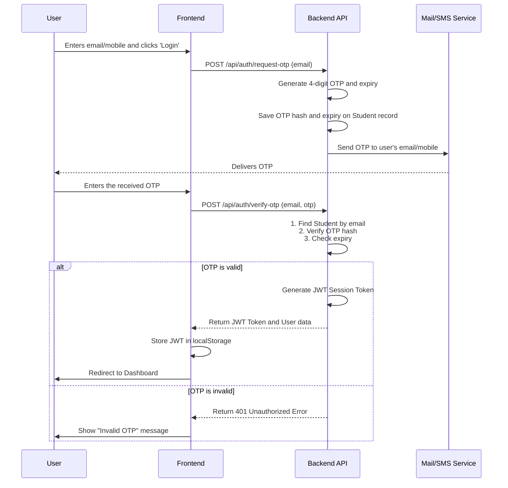
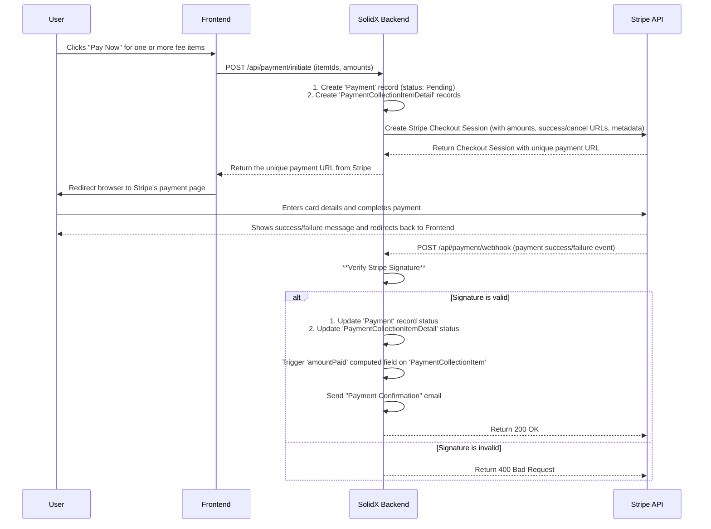

# 3. Student Portal & Payments

This section details the student and parent-facing portal, covering everything from logging in to making payments and receiving notifications.

## Getting the Frontend Code

To build the student portal, we will use a separate frontend application built with Next.js. A starter repository is provided to give you the basic structure, UI components, and API service helpers.

:::info
**Action Required: Clone the Starter Repository**

[➡️ TODO: Insert Git repository link here](https://github.com/solidstarters/school-fees-portal-frontend-starter)

Clone this repository to your local machine.
:::

## Student/Parent Login Flow

The portal uses a secure, passwordless OTP (One-Time Password) login system.

### Login Sequence Diagram



## The Student Dashboard

Once logged in, the parent is presented with a clear, concise dashboard showing:
-   **Student's Name and ID**
-   **Outstanding Fees:** A list of all fees that are `Pending` or `Partially Paid`, with amounts and due dates. Each item has a "Pay Now" button.
-   **Payment History:** A table showing all previous payments, their status (`Succeeded`, `Failed`), and dates.

## The Payment Flow

When a user clicks "Pay Now", it initiates a multi-step process involving the frontend, the SolidX backend, and the Stripe payment gateway.

### Payment Sequence Diagram



### Consuming Webhooks Securely

A critical step in payment processing is handling the webhook from the payment gateway. You **must** verify that the webhook request actually came from Stripe.

**Example: Stripe Webhook Verification in a NestJS Controller**
```typescript
// school-fees-portal/solid-api/src/fees-portal/controllers/payment.controller.ts
import { Headers, Controller, Post, Req, RawBodyRequest } from '@nestjs/common';
import Stripe from 'stripe';

@Controller('payment')
export class PaymentController {
  private readonly stripe: Stripe;
  private readonly webhookSecret: string = process.env.STRIPE_WEBHOOK_SECRET;

  // ... constructor
  
  @Post('webhook')
  async handleStripeWebhook(@Headers('stripe-signature') signature: string, @Req() req: RawBodyRequest<Request>) {
    let event: Stripe.Event;

    try {
      // Use the raw body to construct the event
      event = this.stripe.webhooks.constructEvent(
        req.rawBody,
        signature,
        this.webhookSecret,
      );
    } catch (err) {
      console.error(`Webhook signature verification failed.`);
      // On error, return a 400
      return { error: `Webhook Error: ${err.message}` };
    }

    // Handle the event
    switch (event.type) {
      case 'checkout.session.completed':
        const session = event.data.object;
        // Payment was successful, find the Payment record via metadata
        // and update its status in your database.
        await this.paymentService.processSuccessfulPayment(session);
        break;
      // ... handle other event types
      default:
        console.log(`Unhandled event type ${event.type}`);
    }

    // Return a 200 to acknowledge receipt of the event
    return { received: true };
  }
}
```

## Automated Processes

The student-facing experience is supported by automated backend processes built on SolidX's core features.

-   **Late Fee Calculation:** This is handled by a **Scheduled Job** (e.g., a `Cron` job) that runs nightly. The job queries for `PaymentCollectionItem` records that are past their `dueDate` and not `Fully Paid`. It then applies late fees according to the logic defined in the `FeeType`.
-   **Email Notifications:** All emails (OTP, payment confirmation, late fee reminders) are sent via the core `EmailService`. This service uses predefined templates, allowing you to manage your email content easily without changing the application code.
